# COMPREHENSIVE BACKEND AUDIT REPORT
## Project: Trading Automation v2 — Python Backtest Engine

---

> [!NOTE]
> **Status: FULLY RESOLVED & COMPLETED (100%)** — *May 21, 2026*
> Every security vulnerability, architectural coupling risk, configuration sprawl, test coverage gap, and dependency issue identified in this report has been fully implemented, refactored, and validated.

## 1. Executive Summary & Risk Dashboard

This document presents the exhaustive architectural, code-quality, performance, security, and test suite audit of the Python backend (`backtest_engine/`) in the `trading_automation_v2` project. 

The core engine is structurally robust in parts—particularly its SQLite WAL mode implementation and the core broker simulator logic—but suffers from **tight coupling**, **hardcoded path dependencies**, **configuration duplication**, **test coverage gaps**, and **FastAPI endpoint validation flaws** that introduce moderate-to-high security and reliability risks. All these issues have now been fully resolved.

### 1.1 Architectural Coupling Diagram

The modular coupling graph below highlights how strategy classes and runners are explicitly imported across multiple orchestrators, violating isolation principles:

```mermaid
graph TD
    classDef highRisk stroke:#ef4444,stroke-width:2px,fill:#fef2f2;
    classDef medRisk stroke:#f59e0b,stroke-width:2px,fill:#fffbeb;
    classDef safe stroke:#10b981,stroke-width:2px,fill:#ecfdf5;

    CLI["__main__.py (CLI)"]:::medRisk
    WebAPI["web.py (FastAPI)"]:::highRisk
    Optimizer["optimizer.py (Grid)"]:::medRisk
    Bayesian["bayesian_optimizer.py"]:::medRisk
    WalkForward["walk_forward.py"]:::highRisk

    AVT["adaptive_volatility_trend.py"]:::safe
    Bjorgum["bjorgum_double_tap.py"]:::safe
    Commas["commas_bot.py"]:::safe
    HMA["hma_crossover.py"]:::safe
    Noise["noise_boundary_intraday.py"]:::highRisk
    PMax["pmax_explorer.py"]:::safe
    RF["range_filter.py"]:::safe

    CLI -->|Explicitly Imports| AVT
    CLI -->|Explicitly Imports| Bjorgum
    CLI -->|Explicitly Imports| Commas
    CLI -->|Explicitly Imports| HMA
    CLI -->|Explicitly Imports| Noise
    CLI -->|Explicitly Imports| PMax
    CLI -->|Explicitly Imports| RF

    WebAPI -->|Explicitly Imports| AVT
    WebAPI -->|Explicitly Imports| Bjorgum
    WebAPI -->|Explicitly Imports| Commas
    WebAPI -->|Explicitly Imports| HMA
    WebAPI -->|Explicitly Imports| PMax
    WebAPI -->|Explicitly Imports| RF
    %% WebAPI misses Noise Boundary entirely!

    Optimizer -->|Explicitly Imports| AVT
    Optimizer -->|Explicitly Imports| Bjorgum
    Optimizer -->|Explicitly Imports| Commas
    Optimizer -->|Explicitly Imports| HMA
    Optimizer -->|Explicitly Imports| Noise
    Optimizer -->|Explicitly Imports| PMax
    Optimizer -->|Explicitly Imports| RF

    Bayesian -->|Explicitly Imports| AVT
    Bayesian -->|Explicitly Imports| HMA
    Bayesian -->|Explicitly Imports| PMax
    Bayesian -->|Explicitly Imports| RF

    WalkForward -->|Tight Coupling| Noise
```



---

### 1.2 Prioritized Risk Dashboard

| Severity | Risk Title | Affected Components | Description | Refactoring Effort | Impact | Status |
| :--- | :--- | :--- | :--- | :---: | :---: | :---: |
| 🔴 **CRITICAL** | **FastAPI Arbitrary File Write & Path Traversal** | `web.py` & `global_analysis.py` | `/api/global-analysis` fails to validate user-supplied `request.output_dir` via `resolve_repo_path`, allowing malicious path traversal to write summary files anywhere. | Low (15 mins) | Extreme | ✅ **RESOLVED** |
| 🔴 **CRITICAL** | **Unbounded Job Folder Deletion Risk** | `web.py` (`api_delete_job`) | Job deletion performs `shutil.rmtree` on `job.output_dir` without validating that it is a specific UUID job folder, risking absolute deletion of high-level directories (e.g. `reports/`). | Low (15 mins) | Extreme | ✅ **RESOLVED** |
| 🟠 **HIGH** | **Incomplete Strategy Integration** | `web.py` & `optimizer.py` | `noise_boundary_intraday` strategy is completely missing from `StrategyPayload` and `_VIEWER_STRATEGY_INDICATORS` in the Web API, and has no registered prescan in `_STRATEGY_PRESCANNERS`. | Medium (2 hours) | High | ✅ **RESOLVED** |
| 🟠 **HIGH** | **Environment Mount Hardcoding** | `job_store.py`, `web.py` & `global_analysis.py` | Persistent SQLite path and output directories are hardcoded to `/mnt/venv_ext4/trading_automation_v2/reports/...`, crashing if executed outside this mount environment. | Low (30 mins) | High | ✅ **RESOLVED** |
| 🟠 **HIGH** | **Configuration Sprawl & Redundancy** | `configuration.py` | Generates 3,052 LOC because it duplicates the entire suite of 30+ "V3" config parameters (e.g. safety stops, commissions) separately inside a dictionary for *every single strategy*. | Medium (4 hours) | High | ✅ **RESOLVED** |
| 🟡 **MEDIUM** | **Extreme Import & Routing Coupling** | `__main__.py`, `optimizer.py`, `web.py` | Tight explicit imports of all 7 strategies require modifying multiple files to add a new strategy. | High (6 hours) | Medium | ✅ **RESOLVED** |
| 🟡 **MEDIUM** | **Deep Test Gaps (Coverage: 51%)** | `bayesian_optimizer.py`, `canonical.py` | `bayesian_optimizer.py` has only 22% test coverage, `canonical.py` has 16%, and `global_analysis.py` has 0%. `test_mo_scoring.py` is empty (0 LOC). | High (8 hours) | Medium | ✅ **RESOLVED** |
| 🟡 **MEDIUM** | **Pandas Deep Memory Copies** | `data.py` (`filter_time_window`) | systematically copies dataframes using `.copy()`, doubling memory footprints during high-frequency walk-forward optimization runs. | Low (10 mins) | Medium | ✅ **RESOLVED** |
| 🟢 **LOW** | **Missing Dependencies in requirements.txt** | `requirements-backtest-engine.txt` | Core packages like `optuna`, `vectorbt`, `plotly`, and `pytest` are used but completely undeclared in requirements. | Low (10 mins) | High | ✅ **RESOLVED** |
| 🟢 **LOW** | **Fragile Repo Root CWD Resolution** | `__main__.py` (`_repo_root`) | Resolves root using `Path.cwd()`, making CLI execution dependent on executing from the workspace root. | Low (5 mins) | Medium | ✅ **RESOLVED** |

---

## 2. Quantitative Metrics

Static and runtime metrics were extracted using a custom abstract syntax tree (AST) code parser and a code coverage run.

### 2.1 File Volume & Documentation Analysis

* **Total Python Files Evaluated**: 43 files (comprising 9,671 lines of production code, and 2,298 lines of tests).
* **Top 5 Largest Files (LOC)**:
  1. `configuration.py`: **3,052 LOC** (31.5% of total codebase, extremely bloated due to config dictionaries redundancy).
  2. `web.py`: **1,134 LOC** (Main FastAPI router, contains highly nested routes).
  3. `optimizer.py`: **1,027 LOC** (Grid optimization logic, worker initializers).
  4. `bayesian_optimizer.py`: **734 LOC** (Optuna adapter, complex parameter translations).
  5. `data.py`: **717 LOC** (Data normalization, FX rate provider build).
* **Giant Functions (> 50 LOC)**:
  * `web.py` -> `create_optimizer_app()`: **678 lines** of inline FastAPI endpoints, exception handlers, and routing.
  * `bayesian_optimizer.py` -> `run_bayesian_optimization()`: **462 lines**.
  * `optimizer.py` -> `run_grid_optimization()`: **221 lines**.
  * `__main__.py` -> `build_parser()`: **218 lines**.
  * `strategies/noise_boundary_intraday.py` -> `run_noise_boundary_intraday()`: **219 lines**.

### 2.2 Duplication & Constants Smell

1. **Pine Script to Python Converted Strat Duplication**:
   - `STRATEGY_FILE` resolving the corresponding Pine Script absolute path is duplicated inside every python strategy file:
     `Path(__file__).resolve().parents[2] / 'pine_scripts_convert_to_python' / 'strategy' / ...`
   - Custom features cache cleaning functions (`clear_*_feature_cache()`) are repeated in every strategy file.
2. **Duplicated Constants**:
   - `BASE_TIMEFRAME_MINUTES = 5` is defined in both `data.py` (line 35) and `metrics.py` (line 31).
   - Module level locks `_MODULE_LOCK = threading.Lock()` and name buffers are repeated in `strategies/bjorgum_double_tap.py` and `strategies/commas_bot.py`.

### 2.3 Empirical Test Coverage Statistics
* **Global Test Coverage**: **51%** (6,053 Statements, 2,980 Missed).
* **Test Health by Module**:
  * `configuration.py`: **84%** (Good coverage of CLI parsing / validation).
  * `broker.py`: **89%** (Strong unit validation of executions/fill models).
  * `job_store.py`: **88%** (Process safety and SQLite WAL transactions tested).
  * `optimizer.py`: **79%** (Grid loops and parameter generation tested).
  * `walk_forward.py`: **42%** (Severe integration test gaps).
  * `bayesian_optimizer.py`: **22%** (Extremely low coverage, untested parameter boundaries).
  * `canonical.py`: **16%** (Untested fx data repair continuous loops).
  * `global_analysis.py`: **0%** (100% untested).
  * `prescan_utils.py`: **0%** (100% untested).
  * `vectorbt_bridge/` (all 7 sub-modules): **0%** (100% untested, relies on manual execution).
  * Converted Strategies: Ranges from **21%** (`pmax_explorer.py`) to **81%** (`noise_boundary_intraday.py`).

---

## 3. Detailed Findings by Domain

### 3.1 Architecture & Coupling

> [!WARNING]
> The backend operates with **zero runtime plugin capability**. Every time a developer adds a strategy, they are forced to manually alter multiple central modules.

* **Tight Strategy Coupling**: Central controllers explicitly import all strategy config wrappers and runners.
  * In `__main__.py` (lines 47-75): Massive `if/elif` block to determine config classes and run handles.
  * In `web.py` (lines 34-49): Manual import and manual mapping of strategy mappings.
  * In `optimizer.py` (lines 308-316): Manual registries `_STRATEGY_RUNNERS` and `_STRATEGY_OVERRIDE_CLASSES`.
* **The Missing Strategy Bug in Walk-Forward**: `walk_forward.py` explicitly imports the `noise_boundary_intraday` strategy:
  ```python
  from strategies.noise_boundary_intraday import NoiseBoundaryConfigOverrides, run_noise_boundary_intraday
  ```
  This is a critical architectural violation: walk-forward optimization should be strategy-agnostic, receiving strategy parameters as a dictionary or abstract interface.
* **VectorBT Bridge Isolation**: The `vectorbt_bridge/strategy_bridge.py` is hardcoded to `hma_crossover` strategy (HMAConfigOverrides / run_hma_crossover) despite its documentation declaring it is a generic adapter. It cannot bridge other strategies.

### 3.2 Code Quality & Maintainability

* **Configuration Sprawl**: `configuration.py` contains duplicates of common parameters.
  - A core list of V3 settings (safety stops, commission cash/pct, point values, FX providers, etc.) is duplicated across 7 separate dictionary configurations.
  - Unifying this under a `COMMON_V3_PARAMETERS` dict would eliminate thousands of redundant lines and reduce `configuration.py` from **3,052 LOC** to **~300 LOC**.
* **Type Hint Dilution**: Wide usage of `Any` and `object` on critical objects (e.g. `fx_rate_provider: object | None` in strategies parameters, and `start_date: Any` in `OptimizerRequestPayload`). This breaks IDE completions and runtime diagnostics.
* **Dead Files**: `tests/test_mo_scoring.py` is **0 bytes**. This file represents an uncompleted feature check that should either be implemented or removed.

### 3.3 Performance & Scalability

* **SYSTEMATIC Pandas copying overhead**: In `data.py` -> `filter_time_window()`:
  ```python
  if start_date is not None:
      df = df[df.index >= start_date].copy()
  ```
  Calling `.copy()` makes a complete memory copy of the Pandas DataFrame on each filter, which on long datasets leads to massive RAM spikes and garbage collection pressure when iterated thousands of times during optimization grids.
* **Lack of Optimization Caching**: The same Parquet canonical data files are loaded from disk and parsed inside `load_canonical_market_data()` on every parallel worker. There is no cache or shared memory mechanism, leading to disk I/O bottlenecks.
* **Process Worker Multiprocessing Pool Safety**: `optimizer.py` sets up global workers via `_WORKER_DATA`. Global mutable state in multiprocessing contexts can easily leak between tasks if the workers are reused.

### 3.4 Security & Robustness

> [!CAUTION]
> **Vulnerability #1: Arbitrary File Write in Global Summary API**
> Endpoint `/api/global-analysis` accepts `GlobalAnalysisRequest(output_dir)`. It passes it directly to `generate_global_analysis(repo_root, request.strategy, target_dir)`. Because `Path(A) / B` where `B` is absolute discards `A`, a caller passing `output_dir="/tmp/hma_crossover"` will cause the application to write files to `/tmp/hma_crossover/global_summary.html` and `/tmp/hma_crossover/global_summary.csv`. Since these directories are arbitrary, it allows arbitrary file write under those strategy directories.
> 
> **Vulnerability #2: Recursive Directory Deletion (FastAPI)**
> In `api_delete_job`, the API calls `shutil.rmtree(output_path)`. The path is derived from `job.output_dir`. If the SQLite database stores a job with `output_dir = "/mnt/venv_ext4/trading_automation_v2/reports/local_optimizer"` (or any high-level directory), calling `shutil.rmtree` will recursively delete the **entire** reports folder.

---

## 4. Prioritized Refactoring Plan

The following sprint-based roadmap outlines a clean execution path to modernize and secure the codebase.

### Sprint 1: Security Hardening & Environmental Isolation (Impact: Critical | Effort: Low)
* **Goal**: Close the file-system vulnerabilities and clean hardcoded paths.
* **Tasks**:
  - [x] Add strict `resolve_repo_path` validation on `request.output_dir` inside the FastAPI `api_global_analysis` route in `web.py`.
  - [x] Modify `api_delete_job` to ensure the path being deleted contains a specific UUID subfolder format (e.g. `match_job_uuid = job_id in output_path.name`) to prevent deletion of top-level folders.
  - [x] Replace the hardcoded `/mnt/venv_ext4/...` paths in `job_store.py` and `web.py` with relative paths starting from the repository root (resolved dynamically).
  - [x] Fix the fragile `_repo_root()` function in `__main__.py` to use `Path(__file__).resolve().parents[1]` instead of `Path.cwd()`.

### Sprint 2: Strategy Registry Factory (Impact: High | Effort: Medium)
* **Goal**: Decouple the core engine from explicit strategy implementations.
* **Tasks**:
  - [x] Build a `StrategyRegistry` factory that allows strategies to dynamically self-register with their config classes, custom feature engines, and runners.
  - [x] Refactor `__main__.py`, `web.py`, and `optimizer.py` to route strategies dynamically using the registry instead of long hardcoded `if/elif` lists.
  - [x] Expose the `noise_boundary_intraday` strategy within `web.py` and provide its indicator mappings for the UI charting engine.
  - [x] Generalize `walk_forward.py` to accept strategy variables dynamically, eliminating its hard dependency on `noise_boundary_intraday`.

### Sprint 3: Configuration Deduplication & Performance (Impact: High | Effort: Medium)
* **Goal**: Shrink the config size and optimize Pandas execution speed.
* **Tasks**:
  - [x] Restructure `configuration.py`: extract all duplicated V3 parameters into a single unified `COMMON_V3_PARAMETERS` dict, and inherit/merge these in strategy dictionaries dynamically.
  - [x] Optimize memory footprint in `data.py` -> `filter_time_window()` by using slice views instead of systematic `.copy()` calls unless explicitly required.
  - [x] Clean up the `requirements-backtest-engine.txt` to include `optuna`, `vectorbt`, `plotly`, and `pytest`.

### Sprint 4: Coverage & Test Suite Hardening (Impact: Medium | Effort: High)
* **Goal**: Raise global test coverage to >80% and close integration test gaps.
* **Tasks**:
  - [x] Write robust unit tests for `bayesian_optimizer.py` covering parameter boundaries and constraint evaluations.
  - [x] Address `test_mo_scoring.py`: write unit tests for the multi-objective scoring systems or safely delete the file.
  - [x] Write standard FastAPI `TestClient` routes tests inside `test_backtest_engine.py` to cover endpoint error validations.

---

## 5. Actionable Quick-Wins (<30 mins)

These small improvements can be performed immediately with zero risk of breaking production code:

1. **Deduplicate Timeframe Constants**:
   Create a single source of truth for the base timeframe inside a common config module (e.g. `backtest_engine/constants.py` or similar) to eliminate duplicate definitions in `data.py` and `metrics.py`. [COMPLETED]
2. **Robust Repo Root Resolution**:
   Update `backtest_engine/__main__.py` line 23:
   ```python
   def _repo_root() -> Path:
       return Path(__file__).resolve().parents[1]
   ```
   This ensures CLI operations execute perfectly from any current working directory. [COMPLETED]
3. **SQLite Jobs Path Resolution**:
   Update `job_store.py` line 77:
   ```python
   default_path = Path(__file__).resolve().parents[1] / "reports" / "local_optimizer" / "jobs.sqlite3"
   self._storage_path = Path(storage_path or default_path)
   ```
   This removes the fragile `/mnt/venv_ext4` hardcoding, defaulting to a safe location inside the project directory structure. [COMPLETED]
4. **FastAPI Global Exception Logging**:
   Add a standard Exception logger inside `create_optimizer_app` to dump traceback summaries to the console, ensuring debuggability when worker jobs fail during background executions. [COMPLETED]

---

## 6. Note de Risque sur la Validité des Résultats du Papier

### 6.1 Risque de surapprentissage (Overfitting)

Le papier Maróy est un **préprint SSRN non révisé par les pairs**. Les résultats annoncés (Sharpe > 3.0, rendement > 50%/an) sont statistiquement suspects :

- **Multiple testing problem** : L'optimisation explore des millions de combinaisons de paramètres. D'après Bailey et al. (2016), avec 5 ans de données, tester >45 modèles conduit typiquement à un Sharpe ≥ 1 par hasard. Le papier teste bien plus.
- **Absence de validation out-of-sample** : Le document ne mentionne pas de walk-forward analysis ni de test sur période hold-out. Les paramètres optimaux risquent d'être sur-ajustés à la décennie 2014-2024 du QQQ.
- **Un seul actif** : Les résultats ne sont démontrés que sur QQQ. La généralisation à d'autres actifs est non prouvée.

### 6.2 Réalisme microstructurel

Même si l'implémentation technique réussit, les résultats en live différeront du backtest pour des raisons non modélisées :

- **Slippage** : Le papier modélise les commissions IB mais pas l'impact de marché (market impact) sur des entrées/sorties rapides intraday.
- **Liquidité** : Le QQQ est liquide, mais des ordres de taille significative en intraday peuvent subir du slippage.
- **Latence** : Les stratégies à haute fréquence (1s) sont sensibles à la latence d'exécution, non modélisée.

### 6.3 Recommandation

Avant d'investir dans une implémentation complète, il est **fortement recommandé** de :
1. Implémenter une **validation croisée temporelle (walk-forward)** dès le POC.
2. **Ne pas prendre les Sharpe > 3 au pied de la lettre** ; viser une reproduction du baseline (Sharpe ~1.0-1.3) comme première étape.
3. Tester sur **plusieurs actifs et périodes** pour évaluer la robustesse.

---

## 7. Recommandation d'architecture : Stratégie dédiée

Face à la question « stratégie standalone ou intégration dans chaque stratégie existante ? », l'audit recommande **l'approche stratégie dédiée en deux phases**.

### 7.1 Pourquoi pas l'intégration globale maintenant

Les stratégies actuelles (`hma_crossover`, `pmax_explorer`, `adaptive_volatility_trend`, etc.) sont des logiques de signal conçues pour des exécutions swing/trend avec gestion binaire open/close. Leur architecture n'a pas été pensée pour :
- Des exits dynamiques au VWAP intra-barre.
- Des partial exits (ladder).
- Des re-entries intra-journalières.

Modifier chacune d'elles impliquerait un risque de régression élevé, des tests à refaire en masse, et une complexité inutile pour des stratégies qui n'ont pas vocation à devenir intraday.

### 7.2 Phase 1 — POC isolé (`noise_boundary_intraday`)

Créer une nouvelle stratégie `noise_boundary_intraday.py` dans `backtest_engine/strategies/` avec son propre `ConfigOverrides`, sa logique d'entrée et un exit time-based minimal. Cela permet :
- **Zéro régression** sur les stratégies existantes.
- **Validation rapide** du "noise boundary" sur les données 5m.
- **Référence de comparaison** directe avec HMA/PMax sur les mêmes périodes.
- **Itération sans friction** : tester, casser, recoder sans impacter le reste du système.

### 7.3 Phase 2 — Généralisation (si justifiée)

Si les exits dynamiques démontrent une valeur ajoutée réelle sur le POC, alors refactorer le broker pour les rendre génériques via des options de `exit_mode` dans `configuration.py`. Seulement ensuite, exposer ces modes aux stratégies existantes qui en auraient besoin.

### 7.4 Matrice de décision

| Critère | Stratégie dédiée | Modifier tout |
|:--------|:----------------:|:-------------:|
| Risque de régression | **Faible** | Élevé |
| Temps pour premier résultat | **Court** | Long |
| Facilité à comparer vs baseline | **Élevée** | Faible |
| Généralisation future | Possible | Immédiate mais risquée |
| Respect de l'architecture existante | **Oui** | Non |

## 8. Conclusion

L'intégration des concepts du papier Maróy dans le repo *Trading Automation v2* est **techniquement réalisée** pour les composants stratégie, broker, optimisation, métriques et données haute fréquence. Les phases 0 à 4 du plan d'action sont terminées.

**Axes achevés :**
1. **Broker** : refactor complet pour exits dynamiques (VWAP, ladder, partial exits, orchestration multi-règles) et sizing par volatilité cible.
2. **Optimisation** : contraintes d'interdépendance intégrées dans Optuna, run de 150 trials validé (Sharpe 3.13 en mode `combined` sur LOGI 5m).
3. **Décision outil** : **VectorBT OSS conservé**, broker natif renforcé compense les fonctionnalités Pro.
4. **Données 1m** : datasets Kaggle intégrés et normalisés. WFA baseline sur actions : **Sharpe OOS moyen 4.877** (+88% vs 5m).

**Feuille de route retenue :** Le plan d'action en 5 phases (§5) préconise une approche progressive : infrastructure → POC isolé → broker renforcé → stratégie complète → validation. Les phases 0 à 4 sont terminées. Cette approche minimise le risque de régression et permet un arrêt à chaque phase si les résultats ne justifient pas la poursuite.

**Prochaine étape immédiate** : Voir §9.3 — Actions post-Phase 4.

---

## 9. Résultats Phase 4 — Données 1m (2026-05-19)

> **Note de dépréciation (2026-05-20) :** Les datasets INR (TATASTEEL, ADANIPOWER, CANBK, PNB, TMPV, ETERNAL, BEL, SBIN, MOTHERSON, BHEL) ainsi que le dataset EURINR ont été supprimés du repo. Les résultats WFA ci-dessous concernent ces actifs désormais retirés et ne sont conservés que pour trace historique. Seuls les tickers EUR, USD, CHF et DKK sont actuellement pris en charge.

### 9.1 Contexte

À la suite de la recommandation du §4.1 (gap critique : données haute fréquence), des datasets 1-minute ont été collectés sur Kaggle et normalisés au format canonical Parquet :
- EURUSD (intégrée mais non backtestée car hors-scope).

### 9.2 Résultats WFA — Baseline fixe, 2 ans IS / 1 an OOS

| Symbole | Sharpe OOS moyen | Sharpe OOS min | Sharpe OOS max | MDD OOS moyen | Trades OOS/fold |
|:--------|-----------------:|---------------:|---------------:|:-------------|----------------:|
| TATASTEEL | 5.773 | 3.185 | 7.362 | -52.8% | ~2,000 |
| ADANIPOWER | 4.066 | -0.243 | 6.652 | -54.0% | ~2,500 |
| CANBK | 3.836 | 1.278 | 6.815 | -51.5% | ~1,200 |
| PNB | 5.391 | 3.364 | 6.499 | -48.4% | ~1,200 |
| TMPV | 5.093 | 0.678 | 8.133 | -54.8% | ~1,600 |
| ETERNAL | 7.248 | 7.248 | 7.248 | -62.7% | ~2,700 |
| BEL | 5.287 | 0.560 | 7.514 | -51.0% | ~2,000 |
| SBIN | 4.266 | 1.141 | 7.005 | -48.6% | ~1,000 |
| MOTHERSON | 4.411 | 0.934 | 8.538 | -41.8% | ~1,600 |
| BHEL | 5.295 | 1.397 | 6.517 | -53.0% | ~2,200 |

**Moyenne globale : Sharpe OOS = 4.877** (min=-0.243 sur ADANIPOWER fold 2, max=8.538 sur MOTHERSON fold 2).

**Comparatif vs Phase 4 initiale (5m) :**
| Granularité | Sharpe OOS moyen | Commentaire |
|:------------|-----------------:|:------------|
| 5m (LOGI) | 2.581 | Données US, 1 actif |
| **1m (10 NSE)** | **4.877** | **+88%** de Sharpe, diversification géographique |

**Observations :**
- Le passage au 1m améliore significativement le Sharpe OOS sur la plupart des actifs.
- Le nombre de trades par fold est multiplié par ~4-5x vs le 5m (granularité plus fine = plus de signaux).
- Le MDD reste élevé (-30% à -70%), suggérant que les paramètres baseline ne suffisent pas à contrôler le risque sur tous les actifs.
- ETERNAL (1 fold uniquement, historique court 2021→2025) montre le Sharpe le plus élevé mais avec un historique limité.

### 9.3 Actions post-Phase 4

1. **Ajuster les stops / paramètres de risque** pour réduire le MDD (-30% à -70% observé) sur les actions NSE.
2. **Valider sur une période hold-out indépendante** (ex. 2024-2025) sans ré-optimisation.
3. **Tester en paper trading** avant mise en production.
4. Les datasets INR sont retirés ; seuls les tickers EUR, USD, CHF et DKK sont pris en charge. Une nouvelle WFA sera conduite sur le pool d'actifs européens restant.
