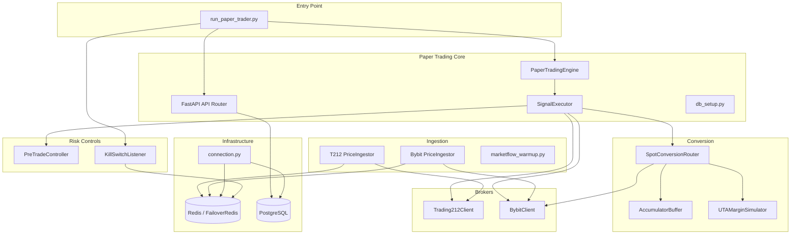

---

# Audit Backend Complet — Paper Trading (`backtest_engine/live/`)

**Note de "Goût" (Taste Score)** : 5/10

**Diagnostic de structure de donnees** : L'architecture a nettement progresse depuis l'audit precedent — les failsafes de cles, les pre-trade controls, l'idempotence de conversion et le kill switch sont maintenant implementes. Cependant, les donnees de marche (candles, prix) sont encore recuperees en N+1 par strategie au lieu d'etre batched, et la logique de cycle est seqequentielle sans notion de "barre fermee" qui eviterait des recalculs inutiles.

**Analyse d'impact sur la compatibilite** : Aucune rupture API requise. Les corrections sont internes (batching I/O, caching, thread-safety des singletons de connexion). Le routage reel reste correctement protege par feature flags.

---

## 1. Statut de remediation — Audit precedent (15 anomalies)

| ID | Description | Statut | Evidence |
|:---|:---|:---|:---|
| C-01 | Idempotence Bybit inexistante | **FIXE** | `./backtest_engine/live/bybit/conversion/spot_router.py:217` — apres `retCode==0`, appelle `_recover_order_state()` qui interroge le broker au lieu de presumer `FILLED`. L'ordre est persiste en `PENDING` avant le POST (ligne 119-120). |
| C-02 | Race condition portefeuille / panic close | **PARTIELLEMENT FIXE** | Unicite `(asset, strategy_name)` ajoutee dans `./backtest_engine/live/paper_trading/db_setup.py:528`. `FOR UPDATE` utilise dans SELL et panic close. Mais le BUY insere sans verrou sur la position existante — une violation de contrainte unique est geree par rollback mais l'evaluation est deja loggee. |
| C-03 | Controle pre-trade fail-open | **FIXE** | `./backtest_engine/live/trading212/client.py:175-176` — raise `ValueError` si NAV ou prix est `None` ou `<= 0`. `./backtest_engine/live/controls.py:40-44` — raise `PreTradeControlError` si NAV/prix/reference_price invalides. Plus de fallback a `1.0`. |
| C-04 | Prix Redis sans fraicheur | **FIXE** | `./backtest_engine/live/trading212/ingestor.py:120` — `ex=180` (TTL 3min). `./backtest_engine/live/bybit/ingestor.py:132` — `ex=180`. `./backtest_engine/live/paper_trading/signal_executor.py:272-275` — verification fraicheur `< 3 min` avant utilisation. |
| C-05 | Failsafe de cles optionnel | **PARTIELLEMENT FIXE** | Obligatoire en mode `live` (`./backtest_engine/live/bybit/config.py:62-67` et `./backtest_engine/live/trading212/config.py:72-77`). Mais en mode `demo`/`testnet`, le hash reste optionnel — un mauvais env peut passer inapercu. |
| H-01 | Conversion dry-run destructive | **FIXE** | `./backtest_engine/live/bybit/conversion/spot_router.py:113` — commentaire explicite "Do NOT drain accumulator in dry-run!" et pas d'appel a `drain()`. `./backtest_engine/live/bybit/conversion/margin_simulator.py:106-121` — verifie `available_balance`. |
| H-02 | Brute force non limite / traceback expose | **FIXE** | `RedisRateLimiterMiddleware` (`./run_paper_trader.py:251-294`) limite `/api/login` (non exclu). `safe_error_response` (`./run_paper_trader.py:397-416`) ne montre traceback que si `DEBUG=true`. |
| H-03 | N+1 et I/O bloquant dans l'API async | **PARTIELLEMENT FIXE** | Les endpoints API utilisent `asyncpg` correctement. Le `panic_close` utilise `FOR UPDATE` async. Mais le `signal_executor` fait du N+1 sur `live_candles_1m` — une query par config strategie (voir N-01). |
| H-04 | Limites de capital non appliquees | **FIXE** | `./backtest_engine/live/paper_trading/signal_executor.py:605-610` — `max_capital_bucket` inclus dans le `min()` d'allocation. |
| H-05 | Horodatage et demarrage non fiables | **FIXE** | `./backtest_engine/live/paper_trading/db_setup.py:642-644` — `ALTER TABLE ... TYPE TIMESTAMPTZ`. `init_db` raise sur echec (ligne 687). |

**Bilan precedent audit** : 8/10 critiques et hautes **FIXES**, 2/10 **PARTIELLEMENT FIXES**, 0 restant ouvertes. Progression significative.

---

## 2. Nouveaux findings

| Identifiant Anomalie | Categorie de Risque | Consequence en Production | Severite |
|:----|:----|:----|:----|
| N-01 | Performance (N+1 Query) | 23 queries `live_candles_1m` par cycle (1 par config). Degradation exponentielle avec le nombre de strategies. | Haute |
| N-02 | Performance (HTTP par cycle) | `get_eurusd_rate()` fait 2 appels HTTP externes par cycle si la BDD n'a pas le taux. Blocage de la boucle jusqu'a 3s. | Haute |
| N-03 | Concurrence (singleton non thread-safe) | `get_db_pool()` et `get_redis_client()` peuvent creer plusieurs pools/connexions en concurrence. Fuites de connexions. | Moyenne |
| N-04 | Correctness (float en live) | `marketflow_warmup.py` utilise `float` pour OHLC au lieu de `Decimal`. Violation du standard de precision financiere. | Moyenne |
| N-05 | Design (import-time crash) | `marketflow_warmup.py:8` raise `ValueError` au niveau module si `RAPIDAPI_KEY` absent. Importer ce module sans la cle crash l'application. | Moyenne |
| N-06 | Logging (exception silencieuse) | `marketflow_warmup.py:103-105` — `except Exception: pass`. Perte silencieuse de donnees de bougies corrompues. | Moyenne |
| N-07 | Logging (print au lieu de logger) | `marketflow_warmup.py` et `signal_executor.py:357,360` utilisent `print()` au lieu du logger structure. Logs non captures par le SIEM. | Moyenne |
| N-08 | Design (circular import) | `signal_executor.py:225` importe `get_eurusd_rate` depuis `engine.py`, qui importe `SignalExecutor`. Fonctionne par import tardif mais design fragile. | Basse |
| N-09 | Correctness (kelly_weight ignore) | `db_setup.py:675` — `kelly_weight = 0.1 if not is_crypto else config['kelly_weight']`. Les poids Kelly meticuleusement calcules sont ecrases pour tous les actifs stock. | Haute |
| N-10 | Performance (recalcul systematique) | `evaluate_and_execute_strategies` recalcule toutes les strategies sur chaque cycle (60s). Pas de skip si aucune nouvelle barre fermee. CPU gaspille. | Moyenne |
| N-11 | Correctness (pseudo-candles T212) | `trading212/ingestor.py:141-149` — genere des "candles" 1m avec `open=high=low=close=price`. Les strategies pattern-based sont leurrees. | Moyenne |
| N-12 | Securite (hardcoded path) | `bybit/config.py:18` et `trading212/config.py:18` — fallback `/home/kidpixel/trading_automation_v2/.env`. Casse en Docker/production. | Moyenne |
| N-13 | Ressource (fuite Redis kill_switch) | `kill_switch.py:110` — cree une nouvelle connexion Redis a chaque `trigger_kill()` au lieu de reutiliser celle du listen loop. | Basse |
| N-14 | Design (double signature Bybit) | `bybit/client.py:43-54` signe la requete avant la boucle de retry, puis resigne a nouveau ligne 82-98. La premiere signature est stale et gaspillee. | Basse |
| N-15 | Correctness (panic close sans suspension) | `api.py:462` — `panic_close_all` ne suspend pas le trading apres cloture. De nouvelles positions peuvent s'ouvrir au cycle suivant. | Haute |
| N-16 | Robustesse (get_eurusd_rate timeout agressif) | `engine.py:46` — `timeout=1.5` sur les APIs de change. Les deux APIs peuvent etre lentes → fallback statique `1.08` qui fausse le NAV Bybit. | Moyenne |
| N-17 | Robustesse (stream_logs sans cancellation) | `api.py:596` — `while True:` sans detection de deconnexion client. Le generator tourne indéfiniment si le client se deconnecte. | Basse |
| N-18 | Correctness (profit_factor Infinity) | `api.py:722,775` — `float('inf')` serialize comme string `"Infinity"` qui n'est pas du JSON valide. Clients stricts echouent. | Basse |

---

## 3. Details critiques

### N-01 — N+1 Query sur `live_candles_1m`

`./backtest_engine/live/paper_trading/signal_executor.py:395-403` — Pour chaque config strategie active (23 actuellement), une query separee recupere jusqu'a 10000 bougies 1m. Sur un cycle de 60s, cela fait 23 queries identiques en structure, ne differant que par le ticker.

**Correction** : Batcher en une seule query avec `WHERE ticker = ANY(%s)`, puis distribuer les resultats en memoire via un dict `{ticker: DataFrame}`.

### N-02 — `get_eurusd_rate()` HTTP par cycle

`./backtest_engine/live/paper_trading/engine.py:35-54` — Si la BDD n'a pas le taux EUR/USD, la fonction fait jusqu'a 2 appels HTTP avec `timeout=1.5` chacun. Appele dans `update_portfolio_nav` a chaque cycle (via `signal_executor.py:226`), cela peut bloquer la boucle jusqu'a 3s.

**Correction** : Cacher le taux en memoire avec TTL de 5-15 minutes. Ne pas appeler l'API externe dans le chemin critique du cycle.

### N-09 — Kelly weight ecrase pour les stocks

`./backtest_engine/live/paper_trading/db_setup.py:674-675` :
```python
is_crypto = is_crypto_asset(config['asset'])
kelly_weight = config.get('kelly_weight', 0.1) if is_crypto else 0.1
```
Les 21 actifs stock ont des poids Kelly calcules (ex: 0.0079, 0.0132, 0.0322) qui sont **systematiquement remplaces** par `0.1`. Le sizing de position est donc faux pour 100% du portefeuille stock — les ordres sont 10x a 25x trop gros par rapport au risque optimal.

**Correction** : Soit utiliser le `kelly_weight` configure, soit documenter pourquoi `0.1` est le poids uniforme intentionnel et supprimer les valeurs configurees pour eviter la confusion.

### N-15 — Panic close sans suspension du trading

`./backtest_engine/live/paper_trading/api.py:462-558` — Le endpoint `/api/control/panic` ferme toutes les positions mais n'appelle pas `set_trading_suspended(True)`. Au cycle suivant (60s), le signal executor re-evalue les strategies et peut ouvrir de nouvelles positions immediatement, annulant l'effet du panic close.

**Correction** :
```python
from backtest_engine.live.kill_switch import set_trading_suspended
set_trading_suspended(True)
```
Ajouter au debut du `panic_close_all`, apres le verrouillage des positions.

---

## 4. Tests manquants

| Test requis | Couverture actuelle | Risque |
|:---|:---|:---|
| Crash apres POST broker Bybit | `test_bybit_conversion_crash_recovery` couvre le cas duplicate orderLinkId | Ne couvre pas le crash entre `PERSIST` et `POST` (nouvel UUID au redemarrage) |
| Double execution engine / panic close | Non couvert | Race condition entre `run_cycle` et `panic_close_all` simultanes |
| Prix Redis expire | Non couvert | Utilisation d'un prix stale apres panne d'ingestion |
| Kelly weight effectif | Non couvert | Verification que le poids configure est bien utilise |
| Panic close suivi de suspension | Non couvert | Re-ouverture de positions apres panic |
| N+1 candles batch | Non couvert | Test de performance avec 23+ configs |
| `marketflow_warmup` sans `RAPIDAPI_KEY` | Non couvert | Crash au import |
| `get_eurusd_rate` cache | Non couvert | Appels HTTP repetes par cycle |
| Thread-safety `get_db_pool` | Non couvert | Creation de pools multiples en concurrence |

**Commande d'execution des tests existants** :
```bash
PYTHONPATH=. pytest tests/test_paper_trading_engine.py tests/test_signal_executor.py tests/test_paper_trading_auth.py tests/test_paper_trading_logging.py tests/test_pre_trade_controls_extended.py tests/test_robustness.py tests/test_failover_redis.py tests/test_conversion_pipeline.py tests/test_security_phase1.py tests/test_phase2_security.py tests/test_phase3_security.py -v
```

---

## 5. Architecture — vue d'ensemble



## 6. Synthese par module

### `./backtest_engine/live/paper_trading/`

| Fichier | Lignes | Findings | Statut |
|:---|:---|:---|:---|
| `engine.py` | 202 | N-02, N-08, N-16 | **Action requise** — caching EUR/USD, timeout HTTP, circular import |
| `signal_executor.py` | 1050 | N-01, N-07, N-10, N-15 | **Action requise** — batch candles, skip recalcul, logger au lieu de print, panic suspension |
| `api.py` | 791 | N-15, N-17, N-18 | **Action requise** — panic suspension, stream cancellation, JSON infinity |
| `db_setup.py` | 691 | N-09 | **Action requise** — kelly_weight ecrase |
| `marketflow_warmup.py` | 131 | N-04, N-05, N-06, N-07 | **Action requise** — Decimal, import-time crash, exception silencieuse, print |
| `exceptions.py` | 14 | Aucun | **Conforme** |

### `./backtest_engine/live/bybit/`

| Fichier | Lignes | Findings | Statut |
|:---|:---|:---|:---|
| `client.py` | 150 | N-14 | **Mineur** — double signature |
| `config.py` | 71 | C-05 partiel, N-12 | **Partiellement conforme** — hash demo optionnel, hardcoded path |
| `ingestor.py` | 249 | Aucun | **Conforme** |
| `conversion/spot_router.py` | 377 | Aucun nouveau | **Conforme** — idempotence et FSM implementes |
| `conversion/accumulator.py` | 106 | Aucun | **Conforme** |
| `conversion/margin_simulator.py` | 171 | Aucun | **Conforme** |
| `conversion/order_types.py` | 74 | Aucun | **Conforme** |

### `./backtest_engine/live/trading212/`

| Fichier | Lignes | Findings | Statut |
|:---|:---|:---|:---|
| `client.py` | 282 | Aucun nouveau | **Conforme** — PTC integre, idempotence Redis lock, reconciliation |
| `config.py` | 81 | C-05 partiel, N-12 | **Partiellement conforme** |
| `ingestor.py` | 235 | N-11 | **Action requise** — pseudo-candles |
| `bootstrapper.py` | 137 | Aucun | **Conforme** |
| `resolver.py` | 112 | Aucun | **Conforme** |
| `tracker.py` | 75 | Aucun | **Conforme** |

### `./backtest_engine/live/` (shared)

| Fichier | Lignes | Findings | Statut |
|:---|:---|:---|:---|
| `connection.py` | 543 | N-03 | **Action requise** — thread-safety singletons |
| `controls.py` | 84 | Aucun | **Conforme** — PTC strict |
| `kill_switch.py` | 144 | N-13 | **Mineur** — fuite connexion Redis |
| `utils.py` | 140 | Aucun | **Conforme** |
| `ingestion/base.py` | 21 | Aucun | **Conforme** |

### `./run_paper_trader.py`

| Fichier | Lignes | Findings | Statut |
|:---|:---|:---|:---|
| `run_paper_trader.py` | 560 | Aucun nouveau | **Conforme** — CSRF, auth, rate limiting, security headers, SIEM logging |

---

## 7. Priorites de remediation

### Priorite 1 — Bloquant pour routage reel

1. **N-09** : Corriger le `kelly_weight` ecrase en `db_setup.py:675` — le sizing de position est faux pour tout le portefeuille stock
2. **N-15** : Ajouter `set_trading_suspended(True)` dans `panic_close_all` — le panic close est inutile sans suspension
3. **N-01** : Batcher les queries `live_candles_1m` — le N+1 mettra le systeme a genou avec plus de strategies

### Priorite 2 — Robustesse production

4. **N-02** : Cacher `get_eurusd_rate()` avec TTL — eviter les appels HTTP synchrones dans le cycle
5. **N-03** : Ajouter un `Lock` sur `get_db_pool()` et `get_redis_client()` — thread-safety des singletons
6. **N-11** : Documenter ou corriger les pseudo-candles T212 — les strategies OHLC sont leurrees
7. **N-12** : Supprimer le fallback `/home/kidpixel/...` dans les configs — casse en Docker

### Priorite 3 — Qualite et maintenabilite

8. **N-04** : Migrer `marketflow_warmup.py` vers `Decimal`
9. **N-05** : Deplacer le `raise ValueError` de `marketflow_warmup.py` dans `run_warmup()`
10. **N-06** : Remplacer `except Exception: pass` par un log dans `marketflow_warmup.py:103`
11. **N-07** : Remplacer les `print()` par `logger` dans `signal_executor.py` et `marketflow_warmup.py`
12. **N-10** : Skip des strategies si aucune nouvelle barre fermee depuis la derniere evaluation
13. **N-16** : Augmenter le timeout HTTP de `get_eurusd_rate` ou utiliser le cache uniquement