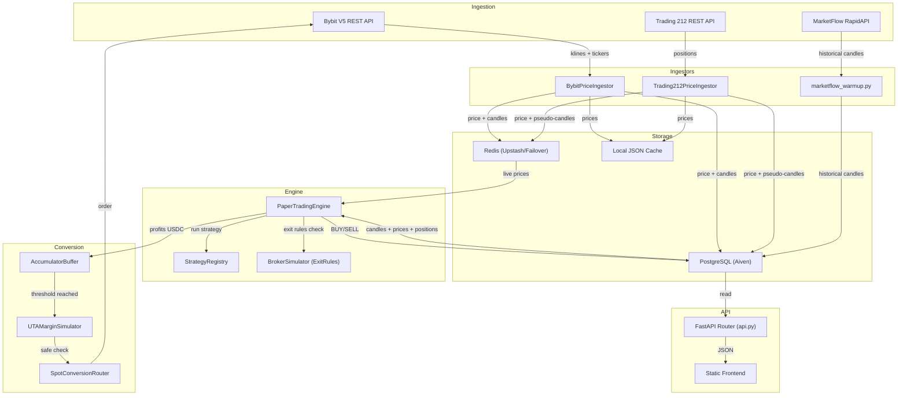

# 🔍 Audit Backend — Paper Trading Engine (`backtest_engine/live/`)

**Date** : 2026-07-03  
**Scope** : 20 fichiers, ~200 KB de code Python  
**Auditeur** : Antigravity AI  
**Mode** : Lecture seule — aucune modification effectuée

---

## Résumé Exécutif

| Sévérité | Nombre | % |
|---|---|---|
| 🔴 CRITICAL | 4 | 10% |
| 🟠 HIGH | 11 | 28% |
| 🟡 MEDIUM | 14 | 36% |
| 🟢 LOW | 10 | 26% |
| **Total** | **39** | 100% |

> [!CAUTION]
> 4 findings CRITICAL identifiés : hardcoded API key, hardcoded email, absence de thread-safety sur le moteur, et incohérence crypto-detection entre modules. Ces éléments représentent des risques financiers et sécuritaires immédiats.

---

## Diagramme de Flux de Données



---

## Findings Détaillés

---

### 🔴 CRITICAL

---

#### C-01 · Clé API RapidAPI hardcodée en clair [RÉSOLU]

**Fichier** : [marketflow_warmup.py](file:///home/kidpixel/trading_automation_v2/backtest_engine/live/paper_trading/marketflow_warmup.py#L8)  
**Lignes** : 8

```python
API_KEY = os.getenv("RAPIDAPI_KEY", "62fd8a4295msh8bb906bd3512057p1c112cjsn626a14c8fcd7")
```

**Impact** : La clé API RapidAPI est exposée en clair dans le code source. Si le repo est public ou partagé, la clé est compromettable. Cela viole directement la règle `codingstandards.md` §2 ("L'écriture en dur ou la journalisation de clés privées et secrets API est strictement interdite").

**Recommandation** :
```python
API_KEY = os.getenv("RAPIDAPI_KEY")
if not API_KEY:
    raise ValueError("[WarmUp] RAPIDAPI_KEY not set. Cannot proceed.")
```

---

#### C-02 · Email Upstash hardcodé en clair [RÉSOLU]

**Fichier** : [connection.py](file:///home/kidpixel/trading_automation_v2/backtest_engine/live/connection.py#L291-L292)  
**Lignes** : 291-292

```python
upstash_email = os.getenv("UPSTASH_EMAIL", "ki2pixel@gmail.com")
upstash_2_email = os.getenv("UPSTASH_2_EMAIL", "ki2pixel@gmail.com")
```

**Impact** : L'email personnel est codé en dur comme fallback. Il peut être utilisé pour du social engineering ou des attaques ciblées sur les comptes Upstash.

**Recommandation** : Supprimer les fallback hardcodés. Si les variables d'environnement ne sont pas définies, lever une erreur ou ignorer la vérification de quota.

---

#### C-03 · Absence totale de thread-safety dans le moteur (`engine.py`) [RÉSOLU]

**Fichier** : [engine.py](file:///home/kidpixel/trading_automation_v2/backtest_engine/live/paper_trading/engine.py#L308-L898)  
**Lignes** : 308-898

**Description** : `run_cycle()` et toutes les méthodes internes (`_update_portfolio_nav`, `_evaluate_and_execute_strategies`) opèrent sur l'état partagé (connexion DB, positions, soldes) sans aucun verrou (`Lock`, `asyncio.Lock`). Le moteur peut être appelé depuis :
- `start_loop` (thread blocking)
- `start_loop_async` (via `asyncio.to_thread`)
- L'API FastAPI (routes comme `panic_close_all` ou `toggle_config` modifient l'état concurremment)

**Impact** : Race conditions possibles entre :
1. `_evaluate_and_execute_strategies()` exécutant un BUY pendant que `_update_portfolio_nav()` lit les positions
2. `panic_close_all()` (API) fermant des positions pendant qu'un cycle d'évaluation est en cours
3. Deux cycles successifs rapprochés (interval < temps de cycle) exécutant des ordres dupliqués

Cela viole directement `codingstandards.md` §3 ("L'accès concurrent aux structures critiques crée des risques de fuite financière").

**Recommandation** :
```python
import threading

class PaperTradingEngine:
    def __init__(self, ...):
        self._cycle_lock = threading.Lock()
        ...

    def run_cycle(self):
        if not self._cycle_lock.acquire(blocking=False):
            logger.warning("[PaperTrader] Cycle already in progress, skipping.")
            return
        try:
            # ... existing cycle logic
        finally:
            self._cycle_lock.release()
```

---

#### C-04 · Incohérence de détection crypto entre modules [RÉSOLU]

**Fichier** : [engine.py](file:///home/kidpixel/trading_automation_v2/backtest_engine/live/paper_trading/engine.py#L117) vs [api.py](file:///home/kidpixel/trading_automation_v2/backtest_engine/live/paper_trading/api.py#L164) vs [api.py](file:///home/kidpixel/trading_automation_v2/backtest_engine/live/paper_trading/api.py#L352)  

| Module | Condition de détection crypto |
|---|---|
| `engine.py` L117 `is_market_open()` | `asset.lower().endswith(("usdt", "usdc"))` ✅ |
| `engine.py` L238 `_update_portfolio_nav()` | `asset_lower.endswith(("usdt", "usdc"))` ✅ |
| `engine.py` L406 `_evaluate_and_execute_strategies()` | `asset.lower().endswith(("usdt", "usdc"))` ✅ |
| `api.py` L164 `is_market_open()` | `asset.lower().endswith("usdt")` ❌ manque "usdc" |
| `api.py` L352 `_panic_close_all_sync()` | `asset.lower().endswith("usdt")` ❌ manque "usdc" |
| `db_setup.py` L654 seed | `config['asset'].lower().endswith("usdt")` ❌ manque "usdc" |

**Impact** : Tous les actifs crypto Bybit sont configurés avec le suffixe `usdc` (ex: `ltcusdc`, `dotusdc`). Les 3 fichiers marqués ❌ ne les reconnaissent pas comme crypto. Conséquences :
- `api.py`:`is_market_open()` rejettera les actifs USDC le week-end (les considérant comme actions)
- `panic_close_all` traitera les positions USDC avec les frais T212 (0%) au lieu de Bybit (0.1%)
- Le seeding force `kelly_weight = 0.1` pour les cryptos USDC (au lieu de la valeur originale)

**Recommandation** : Centraliser la détection crypto dans un helper unique :
```python
# Dans un module utilitaire commun
def is_crypto_asset(asset: str) -> bool:
    return asset.lower().endswith(("usdt", "usdc"))
```

---

### 🟠 HIGH

---

#### H-01 · Redéfinition silencieuse de `print` dans `engine.py`

**Fichier** : [engine.py](file:///home/kidpixel/trading_automation_v2/backtest_engine/live/paper_trading/engine.py#L10-L18)  
**Lignes** : 10-18

```python
def print(*args, **kwargs):
    message = " ".join(str(arg) for arg in args)
    msg_lower = message.lower()
    if "warning" in msg_lower:
        logger.warning(message)
    elif "error" in msg_lower or "failed" in msg_lower or "exception" in msg_lower:
        logger.error(message)
    else:
        logger.info(message)
```

**Impact** : La fonction builtin `print` est écrasée au niveau module. Tout import de `engine.py` modifie le comportement de `print` pour ce module. La détection du niveau de log est basée sur le contenu du message (heuristique fragile : un message contenant "failed" sera toujours loggé comme ERROR même s'il dit "no tests failed").

**Recommandation** : Utiliser `logger` directement avec les bons niveaux au lieu de redéfinir `print`.

---

#### H-02 · `time.sleep()` dans la boucle synchrone du moteur

**Fichier** : [engine.py](file:///home/kidpixel/trading_automation_v2/backtest_engine/live/paper_trading/engine.py#L899-L904)  
**Lignes** : 899-904

```python
def start_loop(self, interval_seconds=60):
    self._running = True
    while self._running:
        self.run_cycle()
        time.sleep(interval_seconds)
```

**Impact** : Quand le moteur est exécuté dans le process FastAPI (via `start_loop_async` qui appelle `asyncio.to_thread(self.run_cycle)`), ce n'est pas un problème direct. Mais `start_loop` (sync) bloque un thread entier. Si le moteur est déclenché depuis un contexte async, `time.sleep(interval_seconds)` bloque le thread pool entier.

**Recommandation** : Ajouter un sleep granulaire avec vérification de `_running` comme dans les ingestors :
```python
def start_loop(self, interval_seconds=60):
    self._running = True
    while self._running:
        self.run_cycle()
        for _ in range(interval_seconds):
            if not self._running:
                break
            time.sleep(1)
```

---

#### H-03 · `marketflow_warmup.py` ne respecte pas le pool de connexions

**Fichier** : [marketflow_warmup.py](file:///home/kidpixel/trading_automation_v2/backtest_engine/live/paper_trading/marketflow_warmup.py#L37-L42)  
**Lignes** : 37-42

```python
def get_db_connection():
    db_url = os.getenv("DATABASE_URL")
    if not db_url:
        print("[WarmUp] DATABASE_URL non définie.")
        return None
    return psycopg2.connect(db_url)
```

**Impact** : Ce module crée une connexion directe `psycopg2.connect()` au lieu d'utiliser le pool centralisé de `connection.py`. Cela :
1. Consomme une connexion hors pool, risquant de dépasser la limite Aiven (max 5)
2. Ne bénéficie pas de la résilience (reconnexion, rollback sur `OperationalError`)
3. La connexion n'est fermée qu'en fin de `run_warmup()`, ce qui peut durer longtemps

**Recommandation** :
```python
from backtest_engine.live.connection import get_db_connection
# Utiliser le context manager du pool
```

---

#### H-04 · `trading212/ingestor.py` contient une méthode `_get_db_connection` morte

**Fichier** : [trading212/ingestor.py](file:///home/kidpixel/trading_automation_v2/backtest_engine/live/trading212/ingestor.py#L17-L23)  
**Lignes** : 17-23

```python
def _get_db_connection(self):
    """Returns a PostgreSQL connection if DATABASE_URL is configured."""
    db_url = os.getenv("DATABASE_URL")
    if not db_url:
        return None
    import psycopg2
    return psycopg2.connect(db_url)
```

**Impact** : Cette méthode crée une connexion directe (hors pool), similaire à H-03. Elle n'est plus utilisée nulle part dans le fichier (remplacée par l'import de `get_db_connection` depuis `connection.py` en L6), mais sa présence est trompeuse et pourrait être utilisée par erreur.

**Recommandation** : Supprimer ce code mort.

---

#### H-05 · Pas de protection division par zéro dans le calcul de quantité [RÉSOLU]

**Fichier** : [engine.py](file:///home/kidpixel/trading_automation_v2/backtest_engine/live/paper_trading/engine.py#L629)  
**Ligne** : 629

```python
qty = allocated_cash / current_price
```

**Impact** : Si `current_price` est `Decimal("0")` (prix corrompu ou absent), une `DivisionByZero` non gérée crashe le cycle entier. Ce scénario est possible si la DB contient un prix à 0 ou si l'API retourne un ticker invalide.

**Recommandation** :
```python
if current_price <= Decimal("0"):
    self._log_evaluation(...)
    continue
qty = allocated_cash / current_price
```

---

#### H-06 · `indicator_params` potentiellement `None` sans guard [RÉSOLU]

**Fichier** : [engine.py](file:///home/kidpixel/trading_automation_v2/backtest_engine/live/paper_trading/engine.py#L631)  
**Ligne** : 631

```python
qty_precision = indicator_params.get("quantity_precision", 6)
```

**Impact** : Si `indicator_params` est `None` (colonne JSONB nulle en DB), l'appel `.get()` sur `None` lève un `AttributeError` qui crashe le cycle. Le même problème existe en L471-477 et L749-793 où `indicator_params` est itéré.

**Recommandation** : Ajouter un guard au début de la boucle :
```python
indicator_params = indicator_params or {}
```

---

#### H-07 · `Decimal` → `float` lossy conversion dans `_log_evaluation`

**Fichier** : [engine.py](file:///home/kidpixel/trading_automation_v2/backtest_engine/live/paper_trading/engine.py#L338)  
**Ligne** : 338

```python
elif isinstance(obj, Decimal):
    return float(obj)
```

Et en L371 :
```python
float(price) if price is not None else None,
```

**Impact** : Le prix dans `paper_evaluations` est stocké comme `float(price)` au lieu de `Decimal`. Pour la colonne `price` de type `NUMERIC`, psycopg2 accepte les `Decimal` nativement. La conversion `float()` introduit une perte de précision inutile dans l'audit trail.

**Recommandation** : Passer `price` directement (le `NUMERIC` SQL le gère). Pour la sérialisation JSON dans `details`, utiliser `str(obj)` au lieu de `float(obj)`.

---

#### H-08 · `trading212/config.py` pointe vers un chemin `.env` inexistant

**Fichier** : [trading212/config.py](file:///home/kidpixel/trading_automation_v2/backtest_engine/live/trading212/config.py#L18)  
**Ligne** : 18

```python
self.dotenv_path = "/home/kidpixel/trading_automation-main/.env"
```

**Impact** : Le fallback pointe vers `trading_automation-main` (ancien nom du repo), alors que le repo actuel est `trading_automation_v2`. Le fichier ne sera jamais trouvé, et les variables ne seront pas chargées si `python-dotenv` n'est pas disponible et que `.env` n'existe pas dans le CWD.

**Recommandation** : Aligner avec `bybit/config.py` qui utilise le bon chemin :
```python
self.dotenv_path = "/home/kidpixel/trading_automation_v2/.env"
```

---

#### H-09 · SELL non sécurisé dans `_panic_close_all_sync` : pas de secured_balance

**Fichier** : [api.py](file:///home/kidpixel/trading_automation_v2/backtest_engine/live/paper_trading/api.py#L362-L372)  
**Lignes** : 362-372

```python
# Update balance
cur.execute("""
    UPDATE paper_portfolio_balance 
    SET cash_balance = cash_balance + %s,
        allocated_balance = GREATEST(0, allocated_balance - %s),
        last_updated = CURRENT_TIMESTAMP
    WHERE source = %s
""", (net_revenue, qty * entry_price, source))
```

**Impact** : Contrairement au SELL dans `engine.py` (L834-852), la fonction `panic_close_all` ne gère pas le cas `pnl > 0 and source == 'bybit'` avec la `secured_balance`. Les profits réalisés en USDC lors d'un panic close ne sont pas convertis en EUR via le secured_balance.

**Recommandation** : Répliquer la logique de `engine.py` L834-844 dans `_panic_close_all_sync`.

---

#### H-10 · Duplication massive de `is_market_open()`

**Fichier** : [engine.py](file:///home/kidpixel/trading_automation_v2/backtest_engine/live/paper_trading/engine.py#L113-L167) vs [api.py](file:///home/kidpixel/trading_automation_v2/backtest_engine/live/paper_trading/api.py#L163-L204)

**Impact** : La logique `is_market_open` est dupliquée entre `engine.py` et `api.py` avec des divergences (voir C-04). Toute correction dans un fichier doit être répliquée manuellement dans l'autre, ce qui est une source certaine de bugs.

**Recommandation** : Extraire dans un module partagé (`backtest_engine/live/utils.py`) et importer dans les deux fichiers.

---

#### H-11 · Pas de validation de `limit` dans l'endpoint `/api/evaluations`

**Fichier** : [api.py](file:///home/kidpixel/trading_automation_v2/backtest_engine/live/paper_trading/api.py#L438)  
**Ligne** : 438

```python
async def get_evaluations(limit: int = 100, status: str | None = None, asset: str | None = None):
```

**Impact** : Le paramètre `limit` n'est pas borné. Un attaquant peut envoyer `limit=999999999` pour forcer la DB à retourner une quantité massive de lignes, causant un OOM ou un timeout.

**Recommandation** :
```python
limit = min(limit, 10000)  # Cap à 10k
```
Même chose pour `/api/candles` (L462).

---

### 🟡 MEDIUM

---

#### M-01 · Imports dynamiques à l'intérieur des fonctions

**Fichiers** : [engine.py](file:///home/kidpixel/trading_automation_v2/backtest_engine/live/paper_trading/engine.py#L27) L27, L42, L130, L174, L310, L387, L447, L555, L746-797

**Impact** : Des imports lourds (`pandas`, `Decimal`, `StrategyRegistry`, `BrokerSimulator`) sont effectués à chaque appel de fonction au lieu d'être importés au niveau module. Pour `pandas` (L447), cela est particulièrement coûteux car l'import se fait à chaque itération de la boucle des configs.

**Recommandation** : Déplacer les imports stables au niveau module. Garder les imports conditionnels uniquement pour les dépendances optionnelles.

---

#### M-02 · Resampling `"min"` potentiellement cassant avec Pandas ≥ 2.x

**Fichier** : [engine.py](file:///home/kidpixel/trading_automation_v2/backtest_engine/live/paper_trading/engine.py#L460)  
**Ligne** : 460

```python
rule = timeframe.replace("m", "min").replace("h", "H")
```

**Impact** : Depuis Pandas 2.2+, les alias d'offset `"min"` et `"H"` sont dépréciés au profit de `"min"` → `"min"` (OK pour l'instant) et `"H"` → `"h"`. De plus, si le timeframe est `"10m"`, la transformation donne `"10min"` qui fonctionne, mais `"45m"` donne `"45min"` et `"60m"` donne `"60min"` — ce qui est correct mais pourrait être `"1h"` pour la lisibilité.

**Recommandation** : Utiliser un mapping explicite :
```python
TIMEFRAME_MAP = {"10m": "10min", "15m": "15min", "20m": "20min", "30m": "30min", "45m": "45min", "60m": "1h"}
```

---

#### M-03 · Volume factice à 0.0 dans les candles resamplees

**Fichier** : [engine.py](file:///home/kidpixel/trading_automation_v2/backtest_engine/live/paper_trading/engine.py#L467)  
**Ligne** : 467

```python
df_aggregated["volume"] = 0.0 # dummy volume
```

**Impact** : Toute stratégie utilisant un filtre de volume (ex: `adaptive_volatility_trend` avec `use_vol: True` dans les seed configs) recevra un volume de 0, ce qui faussera les signaux. Cela pourrait filtrer 100% des entrées sur les stratégies utilisant le volume.

**Recommandation** : Documenter cette limitation ou ingérer le volume depuis les APIs (Bybit le fournit dans les klines).

---

#### M-04 · Pas de timeout Redis dans le `FailoverRedisClient`

**Fichier** : [connection.py](file:///home/kidpixel/trading_automation_v2/backtest_engine/live/connection.py#L225)  
**Ligne** : 225

```python
self._primary_client = redis.Redis.from_url(primary_url, decode_responses=True, max_connections=pool_max)
```

**Impact** : Aucun `socket_timeout`, `socket_connect_timeout`, ou `retry_on_timeout` n'est configuré. Si le serveur Redis ne répond pas, les opérations bloqueront indéfiniment (timeout TCP par défaut ~120s).

**Recommandation** :
```python
redis.Redis.from_url(
    primary_url, decode_responses=True, max_connections=pool_max,
    socket_timeout=5, socket_connect_timeout=5, retry_on_timeout=True
)
```

---

#### M-05 · `_running` flag non thread-safe

**Fichiers** : [engine.py](file:///home/kidpixel/trading_automation_v2/backtest_engine/live/paper_trading/engine.py#L75) L75, [bybit/ingestor.py](file:///home/kidpixel/trading_automation_v2/backtest_engine/live/bybit/ingestor.py#L24) L24

**Impact** : `self._running` est un simple `bool` Python. Bien que le GIL protège les lectures/écritures atomiques en CPython, le pattern est fragile et non-portable. Le flag est modifié par `stop()` (potentiellement depuis un autre thread) et lu dans les boucles.

**Recommandation** : Utiliser `threading.Event` :
```python
self._stop_event = threading.Event()
# Vérifier: not self._stop_event.is_set()
# Arrêter: self._stop_event.set()
```

---

#### M-06 · `log_buffer` deque indexing dans SSE peut rater des logs

**Fichier** : [api.py](file:///home/kidpixel/trading_automation_v2/backtest_engine/live/paper_trading/api.py#L496-L521)  
**Lignes** : 496-521

**Impact** : `log_buffer` est une `deque(maxlen=1000)`. L'indexation par `last_sent_idx` est basée sur `len(log_buffer)` qui peut être inférieur au nombre total de logs ajoutés (les anciens sont évincés). Si le buffer se remplit rapidement, `last_sent_idx` peut pointer en dehors de la deque, causant des logs manqués ou dupliqués.

**Recommandation** : Utiliser un compteur monotone global au lieu de `len(log_buffer)` pour le tracking SSE.

---

#### M-07 · DB Cleanup global dans T212 ingestor

**Fichier** : [trading212/ingestor.py](file:///home/kidpixel/trading_automation_v2/backtest_engine/live/trading212/ingestor.py#L172)  
**Ligne** : 172

```python
cur.execute("DELETE FROM live_candles_1m WHERE timestamp_minute < NOW() - INTERVAL '7 days'")
```

**Impact** : Ce DELETE n'est pas filtré par ticker, contrairement au Bybit ingestor (L161 : `WHERE ticker = %s AND ...`). Cela signifie que le T212 ingestor nettoie les candles de TOUS les tickers (y compris Bybit) à chaque cycle.

**Recommandation** : Ajouter un filtre ou déplacer le cleanup dans un job dédié.

---

#### M-08 · `ExitOrchestrator` évalué deux fois (closed bar + live bar) sans reset

**Fichier** : [engine.py](file:///home/kidpixel/trading_automation_v2/backtest_engine/live/paper_trading/engine.py#L809-L812)  
**Lignes** : 809-812

```python
closed_action = broker.exit_orchestrator.evaluate(bar_dict, broker.position)
live_action = broker.exit_orchestrator.evaluate(live_bar_dict, broker.position)
action = closed_action or live_action
```

**Impact** : Si l'`ExitOrchestrator` a un état interne (ex: `TrailingStopExitRule` qui mémorise le max-price atteint), la deuxième évaluation (`live_action`) sera influencée par l'état modifié durant la première évaluation (`closed_action`). Le trailing stop pourrait être artificiellement déclenché.

**Recommandation** : Instancier un orchestrator frais pour l'évaluation live, ou cloner l'état avant.

---

#### M-09 · `SEED_CONFIGS` écrase `indicator_params` à chaque init

**Fichier** : [db_setup.py](file:///home/kidpixel/trading_automation_v2/backtest_engine/live/paper_trading/db_setup.py#L656-L661)  
**Lignes** : 656-661

```python
cur.execute("""
    INSERT INTO paper_strategy_configs (strategy_name, asset, timeframe, kelly_weight, indicator_params)
    VALUES (%s, %s, %s, %s, %s)
    ON CONFLICT (strategy_name, asset, timeframe) 
    DO UPDATE SET kelly_weight = EXCLUDED.kelly_weight, indicator_params = EXCLUDED.indicator_params
""", ...)
```

**Impact** : L'`ON CONFLICT DO UPDATE` écrase `kelly_weight` et `indicator_params` à chaque démarrage de l'application. Si un utilisateur modifie ces paramètres via l'API (`PUT /configs/{id}`), ils seront réinitialisés au prochain redémarrage.

**Recommandation** : Utiliser `ON CONFLICT DO NOTHING` pour les configs existantes, ou ajouter un flag `user_modified` pour préserver les changements.

---

#### M-10 · Pas de validation de `status` dans l'endpoint `/api/evaluations`

**Fichier** : [api.py](file:///home/kidpixel/trading_automation_v2/backtest_engine/live/paper_trading/api.py#L438)  
**Ligne** : 438

**Impact** : Le paramètre `status` est directement inséré dans la requête SQL (via `%s`), ce qui est sûr côté injection (paramétré), mais n'est pas validé contre les valeurs possibles. Un utilisateur peut passer n'importe quelle string, ce qui retournera un résultat vide sans indication d'erreur.

**Recommandation** : Valider `status` contre un `Enum` des valeurs possibles (`EXECUTED`, `REJECTED`, `ERROR`, `WAITING_DATA`, `NO_SIGNAL`).

---

#### M-11 · `ConfigUpdate` utilise `float` au lieu de `Decimal`

**Fichier** : [api.py](file:///home/kidpixel/trading_automation_v2/backtest_engine/live/paper_trading/api.py#L48-L55)  
**Lignes** : 48-55

```python
class ConfigUpdate(BaseModel):
    initial_capital: float
    initial_capital_bucket: float
    max_capital_bucket: float
    max_entry_price: float
```

**Impact** : Les montants financiers passés via l'API sont des `float`, ce qui introduit des erreurs d'arrondi lors du stockage en DB (colonne `NUMERIC`). Cela viole `codingstandards.md` §2 pour le paper trading.

**Recommandation** : Utiliser `Decimal` avec un validateur Pydantic.

---

#### M-12 · T212 Ingestor construit des pseudo-candles de qualité dégradée

**Fichier** : [trading212/ingestor.py](file:///home/kidpixel/trading_automation_v2/backtest_engine/live/trading212/ingestor.py#L161-L169)  
**Lignes** : 161-169

```python
cur.execute("""
    INSERT INTO live_candles_1m (ticker, timestamp_minute, open, high, low, close)
    VALUES (%s, date_trunc('minute', CURRENT_TIMESTAMP), %s, %s, %s, %s)
    ON CONFLICT (ticker, timestamp_minute)
    DO UPDATE SET 
        high = GREATEST(live_candles_1m.high, EXCLUDED.high),
        low = LEAST(live_candles_1m.low, EXCLUDED.low),
        close = EXCLUDED.close;
""", (normalized_ticker, price, price, price, price))
```

**Impact** : L'`open` est toujours écrasé avec le prix courant lors de l'INSERT initial, mais n'est pas mis à jour dans le `DO UPDATE`. C'est correct. Cependant, le polling est fait toutes les 60s, ce qui signifie qu'une seule cotation par minute est capturée. Le `high` et `low` ne représentent que le min/max des prix vus par le poller, pas les vrais extrema de marché.

**Recommandation** : Documenter cette limitation. Les stratégies qui dépendent de `high/low` précis (ex: brackets SL/TP) auront un biais.

---

#### M-13 · `total_entry_cost` inclut les frais dans le P&L mais pas dans `allocated_balance`

**Fichier** : [engine.py](file:///home/kidpixel/trading_automation_v2/backtest_engine/live/paper_trading/engine.py#L824-L826)  
**Lignes** : 824-826

```python
total_entry_cost = (qty * entry_price) * (Decimal("1.0") + fee_rate)
pnl = net_revenue - total_entry_cost
```

Et L688 (BUY) :
```python
(total_buy_cost, actual_cost, source)  # cash -= total_buy_cost, allocated += actual_cost
```

**Impact** : À l'achat, `cash_balance` est réduit de `total_buy_cost` (incluant les frais), mais `allocated_balance` n'est augmenté que de `actual_cost` (sans frais). Les frais "disparaissent" du bilan — ils ne sont ni dans `cash_balance`, ni dans `allocated_balance`, ni dans `total_nav` (qui est recalculé). Le P&L au SELL est correct (il déduit les frais des deux côtés), mais le tracking comptable intermédiaire est incorrect.

**Recommandation** : Ajouter une colonne `fees_paid` dans `paper_portfolio_balance` ou inclure les frais dans `allocated_balance`.

---

#### M-14 · Bybit SELL ne retourne que `total_entry_cost` au cash en cas de profit

**Fichier** : [engine.py](file:///home/kidpixel/trading_automation_v2/backtest_engine/live/paper_trading/engine.py#L834-L844)  
**Lignes** : 834-844

```python
if pnl > 0 and source == 'bybit':
    eurusd_rate = get_eurusd_rate(conn)
    pnl_eur = pnl / eurusd_rate
    cur.execute("""
        UPDATE paper_portfolio_balance 
        SET cash_balance = cash_balance + %s,
            secured_balance = secured_balance + %s,
            allocated_balance = GREATEST(0, allocated_balance - %s),
            ...
    """, (total_entry_cost, pnl_eur, qty * entry_price, source))
```

**Impact** : Quand `pnl > 0`, le cash est augmenté de `total_entry_cost` (coût d'entrée + frais d'entrée), pas de `net_revenue` (produit de vente - frais de vente). Le profit USDC est mis en `secured_balance` (EUR), mais le montant ajouté au cash n'inclut pas le profit USDC — il ne retourne que le capital initial. C'est cohérent avec la logique "profit → secured → conversion EUR", mais si `pnl < 0`, le code L845-852 ajoute `net_revenue` (qui est inférieur au capital initial). Cela crée une asymétrie de traitement.

**Recommandation** : Documenter clairement cette logique comptable et vérifier que `total_entry_cost` est bien le montant qu'on veut retourner au cash (et non `net_revenue` comme dans le cas `pnl <= 0`).

---

### 🟢 LOW

---

#### L-01 · `bybit_client._request()` appelé directement depuis `SpotConversionRouter`

**Fichier** : [spot_router.py](file:///home/kidpixel/trading_automation_v2/backtest_engine/live/bybit/conversion/spot_router.py#L113)  
**Ligne** : 113

```python
response = self.client._request("POST", "/v5/order/create", ...)
```

**Impact** : L'utilisation directe de `_request` (méthode privée) crée un couplage fort avec l'implémentation interne de `BybitClient`. Si la signature de `_request` change, le router cassera silencieusement.

**Recommandation** : Ajouter une méthode publique `place_spot_order()` dans `BybitClient`.

---

#### L-02 · Constantes dupliquées entre modules

**Fichiers** : Tables SQL créées dans [bybit/ingestor.py](file:///home/kidpixel/trading_automation_v2/backtest_engine/live/bybit/ingestor.py#L37-L58), [trading212/ingestor.py](file:///home/kidpixel/trading_automation_v2/backtest_engine/live/trading212/ingestor.py#L31-L49), et [db_setup.py](file:///home/kidpixel/trading_automation_v2/backtest_engine/live/paper_trading/db_setup.py#L563-L584)

**Impact** : Le DDL des tables `live_prices` et `live_candles_1m` est dupliqué 3 fois. Un changement de schéma (ex: ajout d'une colonne `volume`) doit être répliqué manuellement.

**Recommandation** : Centraliser les DDL dans `db_setup.py` uniquement, les ingestors ne font que vérifier l'existence.

---

#### L-03 · `TICKER_MAPPING` dupliqué dans 2 fichiers

**Fichiers** : [marketflow_warmup.py](file:///home/kidpixel/trading_automation_v2/backtest_engine/live/paper_trading/marketflow_warmup.py#L13-L35) et [trading212/ingestor.py](file:///home/kidpixel/trading_automation_v2/backtest_engine/live/trading212/ingestor.py#L70-L92) et [trading212/resolver.py](file:///home/kidpixel/trading_automation_v2/backtest_engine/live/trading212/resolver.py#L11-L33)

**Impact** : Trois mappings de tickers indépendants. Ajouter un nouvel actif nécessite de modifier 3 fichiers + le `SEED_CONFIGS` dans `db_setup.py`.

**Recommandation** : Centraliser dans un fichier de configuration unique (ex: `configs/assets.json`).

---

#### L-04 · SSE endpoint (`/api/logs/stream`) sans timeout ni limite de connexions

**Fichier** : [api.py](file:///home/kidpixel/trading_automation_v2/backtest_engine/live/paper_trading/api.py#L495-L522)  
**Lignes** : 495-522

**Impact** : Chaque connexion SSE maintient un coroutine async indéfiniment. Sans limite de connexions simultanées ni timeout, un attaquant peut ouvrir des centaines de connexions et épuiser les ressources du serveur.

**Recommandation** : Ajouter un timeout global (ex: 1 heure) et un compteur de connexions.

---

#### L-05 · `BybitConfig.validate()` ne lève pas d'exception

**Fichier** : [bybit/config.py](file:///home/kidpixel/trading_automation_v2/backtest_engine/live/bybit/config.py#L49-L52)  
**Lignes** : 49-52

```python
def validate(self) -> None:
    if not self.api_key or not self.api_secret:
        print("[BybitConfig] WARNING: Bybit API Key or Secret is missing...")
```

**Impact** : Contrairement à `Trading212Config.validate()` qui lève une `ValueError`, la validation Bybit est silencieuse. Cela est voulu (mode public-only), mais le pattern n'est pas symétrique entre les deux configs.

**Recommandation** : Documenter clairement ce choix ou adopter un pattern uniform (ex: un flag `strict_mode`).

---

#### L-06 · `db_setup.py` seed écrase les `kelly_weight` pour les actions

**Fichier** : [db_setup.py](file:///home/kidpixel/trading_automation_v2/backtest_engine/live/paper_trading/db_setup.py#L653-L655)  
**Lignes** : 653-655

```python
is_crypto = config['asset'].lower().endswith("usdt")
kelly_weight = config.get('kelly_weight', 0.1) if is_crypto else 0.1
```

**Impact** : Toutes les actions reçoivent un `kelly_weight` de 0.1, ignorant la valeur optimisée dans `SEED_CONFIGS` (ex: NVO = 0.0073, SAP = 0.0154). De plus, la détection crypto ne vérifie que "usdt" (voir C-04), donc les cryptos USDC reçoivent aussi 0.1.

**Recommandation** : Utiliser les valeurs optimisées de `SEED_CONFIGS` ou ajouter un commentaire expliquant pourquoi un kelly uniforme est préféré.

---

#### L-07 · Pas de CORS configuré sur l'API

**Fichier** : [api.py](file:///home/kidpixel/trading_automation_v2/backtest_engine/live/paper_trading/api.py)

**Impact** : Si le frontend est servi depuis un domaine différent (ex: Render), les requêtes cross-origin seront bloquées par les navigateurs.

**Recommandation** : Configurer CORS dans le routeur ou l'application FastAPI parente.

---

#### L-08 · `FailoverPipeline` ne gère pas `__enter__`/`__exit__` proprement si failover

**Fichier** : [connection.py](file:///home/kidpixel/trading_automation_v2/backtest_engine/live/connection.py#L176-L181)  
**Lignes** : 176-181

**Impact** : Si un failover se produit pendant l'exécution d'un pipeline, `_active_pipeline` est remplacé, mais `__exit__` est toujours appelé sur l'ancien pipeline. Ce n'est pas critique car les pipelines Redis sont stateless, mais c'est un anti-pattern.

---

#### L-09 · Pas de docstring sur `PaperTradingEngine.__init__`

**Fichier** : [engine.py](file:///home/kidpixel/trading_automation_v2/backtest_engine/live/paper_trading/engine.py#L68-L103)

**Impact** : La classe principale du moteur n'a pas de docstring de classe ni de docstring `__init__`, ce qui rend la compréhension du comportement initial (clients T212/Bybit, market hours) plus difficile.

---

#### L-10 · `BasePriceIngestor` ne définit pas `read_cache` ni `bootstrap_historical_candles`

**Fichier** : [ingestion/base.py](file:///home/kidpixel/trading_automation_v2/backtest_engine/live/ingestion/base.py)

**Impact** : La classe abstraite ne définit que 3 méthodes (`poll_and_cache`, `start_loop`, `start_loop_async`), mais les ingestors concrets implémentent aussi `read_cache()` et `bootstrap_historical_candles()` (Bybit uniquement). L'interface est incomplète.

**Recommandation** : Ajouter `read_cache` comme méthode abstraite. `bootstrap_historical_candles` pourrait être une méthode concrète avec implémentation par défaut no-op.

---

## Matrice de Cohérence Inter-Modules

| Critère | Bybit | Trading 212 | Cohérent ? |
|---|---|---|---|
| Hérite `BasePriceIngestor` | ✅ | ✅ | ✅ |
| Utilise `get_db_connection()` (pool) | ✅ | ✅ + code mort `_get_db_connection` | ⚠️ H-04 |
| Utilise `get_redis_client()` | ✅ | ✅ | ✅ |
| `Decimal` pour prix | ✅ `Decimal(k[1])` | ❌ `float(price)` | ⚠️ |
| Backoff exponentiel REST | ✅ (dans `client.py`) | ✅ (dans `client.py`) | ✅ |
| Rate limiting client-side | ❌ Non implémenté | ✅ `_throttle()` + `_endpoint_delays` | ⚠️ |
| Cleanup candles 7d | ✅ filtré par ticker | ❌ global (tous les tickers) | ⚠️ M-07 |
| `config.validate()` comportement | ⚠️ Warning seulement | ✅ Raise ValueError | ⚠️ L-05 |
| Fallback `.env` path | ✅ `trading_automation_v2` | ❌ `trading_automation-main` | ❌ H-08 |
| Signal handling (SIGTERM/SIGINT) | ✅ | ✅ | ✅ |
| Async loop (`start_loop_async`) | ✅ | ✅ | ✅ |
| Bootstrap historical klines | ✅ (`bootstrap_historical_candles`) | ❌ Non implémenté | ⚠️ Design choice |
| Pseudo-candle quality | ✅ Vrais klines API | ⚠️ Pseudo-candles position | ⚠️ M-12 |
| Auth method | HMAC-SHA256 (V5) | HTTP Basic Auth | ✅ (conforme specs) |

---

## Checklist de Conformité vs Skills

### 🔧 execution-order-routing

| Exigence | Statut | Notes |
|---|---|---|
| FSM (New→Pending→Filled/Canceled/Rejected) | ✅ | `ConversionOrderStatus` enum couvre tous les états |
| Idempotence via `client_order_id` | ✅ | `orderLinkId` + `_recover_order_state()` |
| `Decimal` obligatoire en Live | ✅ | conversion/ utilise Decimal partout |
| Logging transactionnel JSON | ✅ | `_log_conversion()` avec audit DB |
| Pre-trade checks | ✅ | `UTAMarginSimulator.check_conversion_safety()` |

### 📊 market-data-ingestion

| Exigence | Statut | Notes |
|---|---|---|
| WebSockets pour le temps réel | ❌ | Polling REST uniquement (toutes les 60s) |
| Backoff exponentiel obligatoire | ✅ | Implémenté dans les deux `client.py` |
| Normalisation multi-broker | ⚠️ | Ticker normalization diverge (3 mappings) |
| Nettoyage (pas de NaN/inf) | ⚠️ | Pas de validation explicite sur les prix ingérés |
| `Decimal` pour bid/ask live | ⚠️ | Bybit: ✅ / T212: ❌ (float) |

### 💰 risk-money-management

| Exigence | Statut | Notes |
|---|---|---|
| Position sizing dynamique (ATR-based) | ⚠️ | Kelly-based, pas ATR-based |
| Pre-trade checks (capital dispo, exposition max) | ✅ | Cash check, kelly limit, max_entry_price |
| `Decimal` en Live | ✅ | engine.py utilise Decimal pour calculs |
| Corrélations inter-actifs | ❌ | Non implémenté |
| Slippage réaliste sur stops | ❌ | Fill au prix exact (pas de slippage modélisé) |

### 📡 trading212-api

| Exigence | Statut | Notes |
|---|---|---|
| Auth HTTP Basic | ✅ | `HTTPBasicAuth` dans client.py |
| Environnements Demo/Live | ✅ | Via `T212_ENV` |
| Convention quantité (+BUY/-SELL) | ✅ | `place_market_order(ticker, quantity)` |
| Rate limiting 50 req/min | ✅ | `_throttle()` + `_endpoint_delays` |
| Caching metadata | ✅ | `resolver.py` cache instruments 1h |
| Max 50 ordres pending par ticker | ❌ | Non vérifié |

---

## Recommandations Prioritaires

> [!IMPORTANT]
> **Actions immédiates (Sprint 0)** — FINALISÉES ✅ :
> 1. **C-01** : Retirer la clé API RapidAPI hardcodée — **Résolu**
> 2. **C-02** : Retirer l'email hardcodé — **Résolu**
> 3. **C-04** : Unifier la détection crypto (`usdt` + `usdc`) — **Résolu**
> 4. **C-03** : Ajouter un `threading.Lock` sur `run_cycle()` — **Résolu**
> 5. **H-05** : Protéger la division par zéro sur `current_price` — **Résolu**
> 6. **H-06** : Guard `indicator_params or {}` en début de boucle — **Résolu**

> [!TIP]
> **Actions structurelles (Sprint 1)** — réduction de la dette technique :
> 1. Extraire `is_market_open()`, `is_crypto_asset()`, et les mappings de tickers dans un module `utils.py` partagé
> 2. Supprimer le code mort (`_get_db_connection` dans T212 ingestor, `print` override)
> 3. Corriger le fallback `.env` dans `Trading212Config` (H-08)
> 4. Ajouter des timeouts Redis (M-04)
> 5. Borner les paramètres `limit` sur les endpoints API (H-11)
> 6. Corriger le seeding pour ne pas écraser `indicator_params` (M-09)
