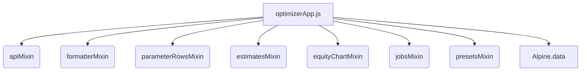

# Rapport d'Audit Frontend Complet - Trading Automation v2

Ce rapport présente une analyse approfondie et exhaustive de l'architecture, du design, des performances et de la sécurité du frontend de l'application **Trading Automation v2**. 

L'application offre deux interfaces principales :
1. **L'Optimiseur Local (`index.html`)** : Tableau de bord pour configurer, exécuter et superviser les jobs d'optimisation (Grid et Bayesian).
2. **Le Visualiseur Interactif (`viewer.html`)** : Interface d'exploration avancée des bougies (OHLC) et indicateurs techniques d'un run, basée sur **KLineCharts**.

---

## 1. Synthèse Executive

L'interface utilisateur de l'application est **performante, moderne et fluide**. Son développement s'appuie sur une philosophie légère ("Vanilla/No-Build") très efficace pour du prototypage rapide et des outils internes.

### Points Forts Clés
* **Légèreté & Fluidité** : Pas d'étape de compilation (Webpack, Vite, etc.), les fichiers statiques sont servis instantanément par le backend FastAPI.
* **Architecture Modulaire** : Division intelligente du code Javascript en mixins thématiques (API, formatters, jobs, presets, charts) réassemblés par Alpine.js.
* **Excellente Expérience Utilisateur (UX)** : 
  * Calcul d'estimation à la volée avec identification des paramètres inactifs et doublons.
  * Arrêt automatique, circuit breaker Optuna et pré-calcul VectorBT gérés élégamment.
  * Graphiques réactifs et performants (Lightweight Charts et KLineCharts).
  * Mode sombre et mode clair natifs supportés par des variables CSS bien orchestrées.

### Risques et Points Critiques à Résoudre
* **Dépendance Totale aux CDN** : Le frontend importe Alpine.js, Lucide Icons, Lightweight Charts et KLineCharts via des CDN (`unpkg`, `jsdelivr`). Sans connexion Internet ou en cas de panne de CDN, le frontend est totalement inutilisable.
* **Risque de Fuites de Mémoire (Polling)** : Des timers (`setTimeout`) et observateurs (`ResizeObserver`) sont créés sans mécanisme de destruction systématique sur le cycle de vie complet de l'application.
* **Absence de Versioning des Assets** : Les fichiers JS locaux sont importés en dur sans versioning/cache-busting (sauf `viewer.js?v=3`), ce qui peut générer des comportements instables après des mises à jour (cache navigateur obsolète).

---

## 2. Analyse de l'Architecture & Stack Technique

### Cartographie des Technologies

Le tableau ci-dessous résume le socle technologique utilisé :

| Composant | Technologie | Rôle / Rationale | Évaluation |
| :--- | :--- | :--- | :--- |
| **Framework State** | **Alpine.js v3** | Réactivité sans surcouche (Directives HTML type `x-data`, `x-model`, `x-show`). | **Excellent choix** pour la simplicité et les performances. |
| **Style** | **Vanilla CSS** | Propriétés personnalisées CSS (Variables) pour support natif Light/Dark mode. | **Trés propre**, structuré et maintenable. |
| **Icônes** | **Lucide Icons** | Icônes SVG légères insérées dynamiquement via `lucide.createIcons()`. | **Moderne** et harmonieux. |
| **Graphique Principal** | **Lightweight Charts** | Graphique financier TradingView pour afficher la courbe d'équité et le Best Run. | **Standard de l'industrie**, haute performance en Canvas 2D. |
| **Graphique Technique** | **KLineCharts v9** | Moteur de rendu spécialisé pour chandeliers et indicateurs multi-panneaux. | **Riche**, personnalisable, parfait pour le mode "Viewer". |

### Modularité et Mixins Javascript

Le fichier principal `optimizerApp.js` charge et fusionne plusieurs mixins déclarés dans la portée globale `window.BacktestOptimizer` :



> [!NOTE]
> Cette structure sous forme de mixins permet de garder des fichiers de moins de 400 lignes chacun, ce qui rend le code très lisible et facilite le travail collaboratif.

---

## 3. Audit Qualitatif des Fonctionnalités Clés

### A. Gestion des Paramètres d'Optimisation
* **Comportement** : L'ajout dynamique de lignes (`addParameterRow`) gère intelligemment la complétion des types (numérique, choix, booléen) et charge les valeurs par défaut issues des schémas des stratégies backend.
* **Validation client** : La fonction `validateParameterRows()` est robuste. Elle vérifie en temps réel les doublons, les types (ex. entiers requis) et la présence de valeurs obligatoires (start/end/step).
* **Détection d'inactivité** : Le frontend masque ou floute élégamment les lignes inactives en se basant sur le payload d'estimation du backend (conditions logiques type `active_if`).

### B. Moteur d'Estimation & AbortController
* **Sécurité des requêtes** : Le frontend implémente des debounces (`debounce.200ms` / `debounce.300ms`) sur les inputs pour éviter de spammer l'API `/api/estimate`.
* **Résilience** : En cas de frappes successives rapides, un `AbortController` annule proprement la requête HTTP en cours avant d'en relancer une nouvelle :
  ```javascript
  if (this.currentEstimateController) this.currentEstimateController.abort();
  const controller = new AbortController();
  this.currentEstimateController = controller;
  ```
  *Ceci garantit l'absence de race conditions (mises à jour asynchrones désordonnées).*

### C. Gestion du Cycle de Vie des Jobs
* **Supervision temps réel** : Le polling (`pollJob()`) s'active automatiquement dès qu'un job est créé ou sélectionné dans un état transitoire (`PENDING`, `IN_PROGRESS`).
* **Robustesse** : La suppression groupée (`deleteSelectedJobs`) et la suppression unitaire gèrent correctement l'avertissement de l'utilisateur, l'interdiction de supprimer un job en cours et la réinitialisation de l'affichage des courbes.

### D. Rendu Graphique & Visualisation
* **Tableau de bord (`equityChart.js`)** :
  * Utilise les deux échelles de prix de **Lightweight Charts** (prix OHLC à droite, courbe d'équité sur une échelle secondaire en bas) pour maximiser la lisibilité.
  * Gère de manière rigoureuse la déduplication temporelle des bougies et des points d'équité (lightweight-charts levant une exception fatale en cas de timestamps dupliqués ou non ordonnés).
* **Visualiseur avancé (`viewer.js`)** :
  * Intégration impeccable des marqueurs d'achat/vente (Buy/Sell) et des indicateurs techniques calculés dynamiquement.
  * Redimensionnement manuel interactif de la sidebar avec propagation du déclencheur `chart.resize()`.

---

## 4. Analyse du Design Visuel & CSS

Le design visuel est **extrêmement soigné** et procure un effet **très premium** ("Wow Effect").

```
Palettes de Couleurs :
- Light mode : Slate / Indigo harmonieux.
- Dark mode  : Zinc sombre avec accents indigo doux (très reposant pour les yeux).
```

### Qualités Visuelles
* **Typographie** : Utilisation de **Plus Jakarta Sans**, une police moderne géométrique qui donne un look pro et haut de gamme.
* **Composants Cards** : Ombrages fins (`--card-shadow`), coins arrondis modernes (`16px`) et bordures subtiles (`#e2e8f0` / `#1e293b`).
* **Transitions Fluides** : Transitions douces de 0.2s sur les changements de thèmes, hovers de boutons et modifications de lignes.
* **Micro-animations** : Le shimmer sur la barre de progression en cours d'optimisation (`#progressBar.animating`) renforce l'aspect dynamique et vivant du produit.

---

## 5. Points de Vigilance & Recommandations d'Amélioration

### 1. Robustesse Hors-ligne et Sécurité (Priorité Haute)
> [!WARNING]
> L'utilisation directe de dépendances stockées sur CDN externes expose l'application à des risques de coupures réseau et à des vulnérabilités de type "Man-in-the-Middle" (en l'absence de hash d'intégrité SRI).

**Solution proposée :**
Télécharger les scripts externes et les servir localement via FastAPI. 
1. Télécharger `alpine.js`, `lucide.js`, `lightweight-charts.js` et `klinecharts.js` dans un répertoire `/backtest_engine/web_static/vendor/`.
2. Mettre à jour les imports dans `index.html` et `viewer.html` :
   ```diff
   - <script src="https://unpkg.com/lucide@latest"></script>
   + <script src="/vendor/lucide.min.js"></script>
   ```

### 2. Gestion et Nettoyage des Événements (Fuites de Mémoire)
Dans `viewer.js`, la sidebar interactive utilise un écouteur d'événement global :
```javascript
startResizeSidebar(e) {
  const onMove = (ev) => { ... };
  const onUp = () => {
    document.removeEventListener('mousemove', onMove);
    document.removeEventListener('mouseup', onUp);
  };
  document.addEventListener('mousemove', onMove);
  document.addEventListener('mouseup', onUp);
}
```
* **Évaluation** : La structure est correcte car elle supprime les écouteurs lors du `mouseup`. Cependant, en cas de re-création de l'application Alpine ou de destruction du DOM, aucun trigger de secours n'est configuré.
* Dans `equityChart.js` et `viewer.js`, le `ResizeObserver` créé sur le conteneur du graphique n'est **jamais déconnecté** explicitement à la destruction du composant, ce qui engendre des fuites mémoire à chaque réinitialisation de graphique (`destroyChart()` / `initChart()`).

**Solution proposée :**
Conserver une référence vers le `ResizeObserver` et appeler `.disconnect()` systématiquement :
```javascript
// Dans equityChart.js
if (this.chartResizeObserver) {
  this.chartResizeObserver.disconnect();
}
this.chartResizeObserver = new ResizeObserver(...);
this.chartResizeObserver.observe(container);
```

### 3. Gestion du cache navigateur (Cache Busting)
Les fichiers Javascript locaux (ex. `/js/optimizerApp.js`) sont mis en cache agressivement par les navigateurs modernes. Lors de mises à jour de code sur le moteur de trading, les utilisateurs risquent de conserver une version obsolète du script JS.

**Solution proposée :**
Utiliser des query parameters dynamiques lors de l'intégration dans le HTML (méthode de cache-busting basique) ou utiliser FastAPI pour injecter un hash de version :
```html
<script src="/js/api.js?v=2026.05.28" defer></script>
<script src="/js/optimizerApp.js?v=2026.05.28" defer></script>
```

### 4. Raccords UX mineurs
* **Indicateur visuel de calcul des itérations bayésiennes** : Quand le mode Bayesian est actif, le nombre total d'itérations estimé change automatiquement selon l'intensité. Un micro-shimmer ou une transition de couleur sur le badge `Canonique / Valides` rendrait ce changement plus évident.
* **Bouton Stop global** : Actuellement, le bouton Stop n'est cliquable que si le job sélectionné est actif. Un bouton "Arrêter tout" (bulk cancel) serait un ajout de confort exceptionnel en cas d'erreur de dimensionnement de grille.

---

## 6. Conclusion de l'Audit

Le frontend de **Trading Automation v2** est un **modèle d'interface vanilla moderne**. Le choix d'Alpine.js couplé à une architecture de mixins bien segmentée permet de maintenir une base de code propre et facilement extensible, sans la lourdeur d'un framework SPA complet (React/Vue/Svelte).

En appliquant les corrections de **sécurisation des CDN (offline first)** et de **gestion propre des ResizeObservers (prévention des fuites de mémoire)**, le produit atteindra un niveau de robustesse industrielle prêt pour la production.
