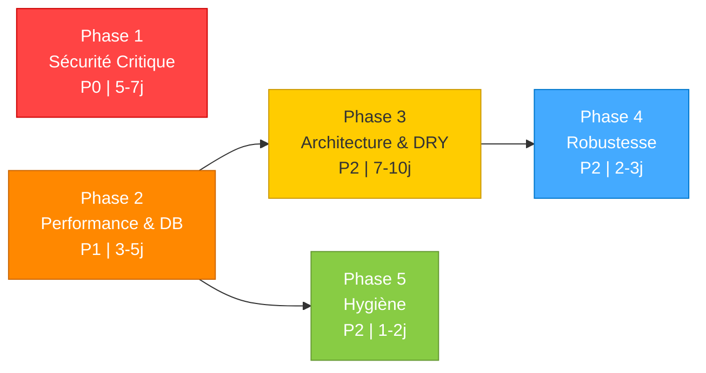
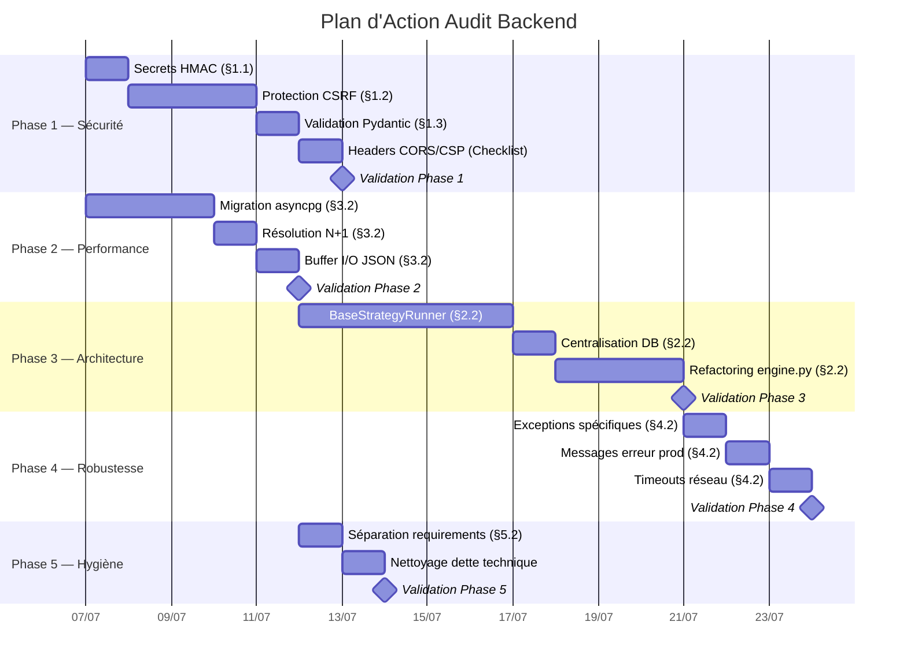

# Plan d'Action Audit Backend — `trading_automation_v2`

> **Source** : [audit-backend-complet.md](file:///home/kidpixel/trading_automation_v2/docs/audit/audit-backend-complet.md) (137 lignes, 5 axes, 14 items)
> **Date** : 2026-07-03
> **Contexte** : Post-migration Supabase → Aiven, Sprint 1 structurel résolu, ingesteur Bybit/Trading212 opérationnel sur Render.

---

## Tableau Récapitulatif

| Phase | Priorité | Items Audit | Effort | Durée Est. | Statut |
|:------|:---------|:------------|:-------|:-----------|:-------|
| **Phase 1 — Sécurité Critique** | P0 Bloquant | §1.1, §1.2, §1.3, Checklist CORS/CSP | L | 5-7 jours | 🟢 Terminé |
| **Phase 2 — Performance & DB** | P1 Haute | §3.2 (pool async), §3.2 (N+1), §3.2 (buffer I/O) | M | 3-5 jours | 🟢 Terminé |
| **Phase 3 — Architecture & DRY** | P2 Moyen | §2.2 (BaseStrategyRunner), §2.2 (connexions DB), §2.2 (engine.py) | XL | 7-10 jours | 🟢 Terminé |
| **Phase 4 — Robustesse** | P2 Moyen | §4.2 (exceptions), §4.2 (fuites info), §4.2 (timeouts réseau) | S | 2-3 jours | 🟢 Terminé |
| **Phase 5 — Hygiène** | P2 Amélioration | §5.2 (dépendances), dette technique résiduelle | S | 1-2 jours | 🟢 Terminé |
| **Total** | | **14 items actifs** | | **18-27 jours** | |

---

## Items Déjà Résolus (Sprint 1 — 2026-07-03)

> [!NOTE]
> Ces items ont été traités lors du Sprint 1 structurel et sont **exclus** du plan d'action ci-dessous. Ils sont conservés ici pour traçabilité.

| Item Audit | Résolution Sprint 1 | Date |
|:-----------|:---------------------|:-----|
| Centralisation config dans `utils.py` | ✅ Configurations et `is_market_open` centralisées | 2026-07-03 12:27 |
| Sécurisation Redis (timeouts) | ✅ Timeouts Redis ajoutés | 2026-07-03 12:27 |
| Bridage `limit` FastAPI | ✅ Paramètre `limit` validé et bridé | 2026-07-03 12:27 |
| Code mort `ingestor.py` | ✅ Overrides de `print` et code mort supprimés | 2026-07-03 12:27 |
| Seeding DB | ✅ Correction du seeding | 2026-07-03 12:27 |

---

## Phase 1 — Sécurité Critique

> **Priorité** : P0 — Bloquant production
> **Objectif** : Éliminer toutes les vulnérabilités critiques identifiées avant tout déploiement en environnement exposé.
> **Effort estimé** : L (5-7 jours-homme)
> **Dépendances** : Aucune — phase initiale.

### Tâche 1.1 — Sécurisation des secrets HMAC (§1.1)

- **Criticité** : ❌ CRITIQUE
- **Fichiers impactés** :
  - [api.py](file:///home/kidpixel/trading_automation_v2/backtest_engine/live/paper_trading/api.py) (ligne 13)
  - [run_paper_trader.py](file:///home/kidpixel/trading_automation_v2/run_paper_trader.py) (lignes 27-28)
- **Actions** :
  - [x] Générer un secret HMAC aléatoire fort au démarrage (≥32 bytes, `secrets.token_hex(32)`) au lieu d'utiliser le mot de passe utilisateur comme clé de signature
  - [x] Séparer `PAPER_TRADER_PASSWORD` (authentification utilisateur) de `HMAC_SECRET` (signature tokens) dans `.env.template`
  - [x] S'assurer que ni le mot de passe ni le secret HMAC ne sont jamais loggés (audit des `logger.info`/`logger.debug`)
  - [x] Ajouter le secret HMAC aux variables d'environnement Render
- **Effort** : S (0.5-1 jour)

### Tâche 1.2 — Protection CSRF (§1.2)

- **Criticité** : ❌ CRITIQUE
- **Fichiers impactés** :
  - [app.js](file:///home/kidpixel/trading_automation_v2/backtest_engine/live/paper_trading/static/app.js) (lignes 1-10)
  - [api.py](file:///home/kidpixel/trading_automation_v2/backtest_engine/live/paper_trading/api.py) (tous les endpoints POST/PUT/DELETE)
- **Actions** :
  - [x] Implémenter un middleware CSRF pour FastAPI (génération de token CSRF côté serveur, inclusion dans les réponses via un cookie `csrftoken`)
  - [x] Ajouter un header personnalisé `X-CSRFToken` à toutes les requêtes mutantes depuis le frontend
  - [x] Vérifier côté serveur la correspondance du token CSRF pour les méthodes `POST`, `PUT`, `DELETE`
  - [x] Vérifier les headers `Origin` et `Referer` comme couche de défense supplémentaire
  - [x] Tester avec un scénario d'attaque CSRF simulé
- **Effort** : M (2-3 jours)

### Tâche 1.3 — Validation Pydantic stricte (§1.3)

- **Criticité** : ⚠ HAUT
- **Fichiers impactés** :
  - [api.py](file:///home/kidpixel/trading_automation_v2/backtest_engine/live/paper_trading/api.py) (lignes 100-105)
- **Actions** :
  - [x] Créer un modèle Pydantic `IndicatorParamsModel` avec les clés et types explicitement autorisés
  - [x] Configurer `model_config = ConfigDict(extra='forbid')` pour rejeter toute clé inconnue (modifié en `extra='allow'` avec vérification via `model_validator` des types primitifs)
  - [x] Remplacer la désérialisation JSON directe de `indicator_params` par la validation via le modèle Pydantic
  - [x] Ajouter des tests unitaires pour les cas valides et les rejets de clés inconnues (ou invalides)
- **Effort** : S (0.5-1 jour)

### Tâche 1.4 — Headers de sécurité CORS/CSP (Checklist ligne 121)

- **Criticité** : ❌ NON IMPLÉMENTÉ
- **Fichiers impactés** :
  - [api.py](file:///home/kidpixel/trading_automation_v2/backtest_engine/live/paper_trading/api.py) ou [run_paper_trader.py](file:///home/kidpixel/trading_automation_v2/run_paper_trader.py)
- **Actions** :
  - [x] Ajouter le middleware `CORSMiddleware` de FastAPI avec une whitelist d'origines stricte (pas de `*` en production)
  - [x] Implémenter un middleware CSP (Content-Security-Policy) pour restreindre les sources de scripts, styles, et images
  - [x] Ajouter les headers de sécurité complémentaires : `X-Content-Type-Options: nosniff`, `X-Frame-Options: DENY`, `Strict-Transport-Security`
  - [x] Tester la conformité des headers avec un outil comme `securityheaders.com`
- **Effort** : S (1 jour)

### Critères de Complétion Phase 1

- [x] Aucun secret utilisateur n'est utilisé comme clé de signature HMAC
- [x] Tous les endpoints mutants sont protégés contre le CSRF
- [x] `indicator_params` est validé par un modèle Pydantic strict
- [x] Les headers CORS, CSP, HSTS, X-Content-Type-Options et X-Frame-Options sont présents en production
- [x] Tests de sécurité passés (CSRF simulé, injection de clés Pydantic, vérification headers)
- [x] Aucune régression sur les fonctionnalités existantes du Paper Trading

---

## Phase 2 — Performance & Base de Données

> **Priorité** : P1 — Haute priorité
> **Objectif** : Éliminer les goulots d'étranglement de performance et les risques de blocage en contexte asynchrone.
> **Effort estimé** : M (3-5 jours-homme)
> **Dépendances** : Aucune — indépendante de Phase 1.

### Tâche 2.1 — Migration vers asyncpg (§3.2 — Pool synchrone)

- **Criticité** : ⚠ HAUT
- **Fichiers impactés** :
  - [connection.py](file:///home/kidpixel/trading_automation_v2/backtest_engine/live/paper_trading/connection.py)
  - [api.py](file:///home/kidpixel/trading_automation_v2/backtest_engine/live/paper_trading/api.py)
  - [engine.py](file:///home/kidpixel/trading_automation_v2/backtest_engine/live/paper_trading/engine.py)
- **Actions** :
  - [x] Installer `asyncpg` et le déclarer dans les requirements
  - [x] Créer un pool asynchrone avec `asyncpg.create_pool()` dans `connection.py`
  - [x] Migrer tous les endpoints FastAPI vers des requêtes asynchrones via le pool `asyncpg`
  - [x] Conserver `psycopg2` pour les workers synchrones (backtest, optimisation) — pas de régression
  - [x] Tester la concurrence sous charge (10+ requêtes simultanées) pour vérifier l'absence de blocages
- **Effort** : M (2-3 jours)

### Tâche 2.2 — Résolution du pattern N+1 (§3.2 — Requêtes N+1)

- **Criticité** : ⚠ HAUT
- **Fichiers impactés** :
  - [engine.py](file:///home/kidpixel/trading_automation_v2/backtest_engine/live/paper_trading/engine.py) (`_update_portfolio_nav`)
- **Actions** :
  - [x] Remplacer la boucle de requêtes individuelles par une requête unique : `SELECT * FROM live_prices WHERE ticker IN ($1, $2, ...)`
  - [x] Mettre à jour les positions en mémoire à partir du résultat groupé
  - [x] Effectuer un `UPDATE` groupé (ou `executemany`) pour persister les MAJ de NAV
  - [x] Mesurer l'amélioration : objectif ≥ 5x pour un portefeuille de 10+ positions
- **Effort** : S (0.5-1 jour)

### Tâche 2.3 — Buffer I/O pour la sérialisation JSON (§3.2 — Surcharge JSON)

- **Criticité** : ⚠ MOYEN
- **Fichiers impactés** :
  - Fichier contenant `_json_dump` (module optimisation)
- **Actions** :
  - [x] Implémenter un buffer en mémoire (liste Python) pour les "best rows" de l'optimisation
  - [x] Écrire sur le disque par lots (toutes les N=50 itérations ou à la fin du trial)
  - [x] Ajouter un flush forcé en cas d'interruption (`atexit` ou `finally`)
  - [x] Mesurer la réduction des appels I/O
- **Effort** : XS (0.5 jour)

### Critères de Complétion Phase 2

- [x] Les endpoints FastAPI utilisent un pool de connexions asynchrone (`asyncpg`)
- [x] La fonction `_update_portfolio_nav` exécute au maximum 2 requêtes SQL (1 SELECT groupé + 1 UPDATE groupé) quel que soit le nombre de positions
- [x] Les écritures JSON d'optimisation sont bufferisées (pas d'I/O à chaque itération)
- [x] Tests de charge : aucun deadlock ou blocage sous 10 requêtes concurrentes
- [x] `psycopg2` reste opérationnel pour les workers synchrones (pas de régression backtest)

---

## Phase 3 — Architecture & DRY

> **Priorité** : P2 — Amélioration
> **Objectif** : Réduire la dette technique, la duplication de code, et améliorer la testabilité du moteur.
> **Effort estimé** : XL (7-10 jours-homme)
> **Dépendances** : Phase 2 (la migration asyncpg dans `connection.py` doit être stabilisée avant de centraliser les connexions DB).

### Tâche 3.1 — Extraction de `BaseStrategyRunner` (§2.2 — Duplication stratégies)

- **Criticité** : ⚠ MOYEN
- **Fichiers impactés** :
  - [hma_crossover.py](file:///home/kidpixel/trading_automation_v2/backtest_engine/strategies/hma_crossover.py)
  - [momentum_based_zigzag.py](file:///home/kidpixel/trading_automation_v2/backtest_engine/strategies/momentum_based_zigzag.py)
  - Toutes les stratégies dans `backtest_engine/strategies/`
  - **Nouveau** : `backtest_engine/strategies/strategy_base.py`
- **Actions** :
  - [x] Auditer les fonctions dupliquées à travers les stratégies : `_normalize_trades`, `_build_state_from_broker`, `_apply_overrides`, boucle de simulation principale
  - [x] Créer une classe abstraite `BaseStrategyRunner` dans `strategy_base.py` encapsulant la logique commune
  - [x] Définir les points d'extension (méthodes abstraites) pour la logique spécifique à chaque stratégie
  - [x] Migrer chaque stratégie existante pour hériter de `BaseStrategyRunner`
  - [x] Valider la compatibilité avec le `StrategyRegistry` existant
  - [x] Objectif : réduction de ≥80% de la duplication mesurée en lignes de code
- **Effort** : L (4-5 jours)

### Tâche 3.2 — Centralisation des connexions DB (§2.2 — Duplication connexion)

- **Criticité** : ⚠ MOYEN
- **Fichiers impactés** :
  - [connection.py](file:///home/kidpixel/trading_automation_v2/backtest_engine/live/paper_trading/connection.py)
  - [api.py](file:///home/kidpixel/trading_automation_v2/backtest_engine/live/paper_trading/api.py)
  - [db_setup.py](file:///home/kidpixel/trading_automation_v2/backtest_engine/live/paper_trading/db_setup.py)
- **Actions** :
  - [x] Faire de `connection.py` le point d'entrée unique pour toute connexion DB (sync et async)
  - [x] Supprimer les créations de connexions dupliquées dans `api.py` et `db_setup.py`
  - [x] Exposer une interface claire : `get_async_pool()` pour FastAPI, `get_sync_connection()` pour les workers
  - [x] Tester que tous les modules utilisent exclusivement `connection.py`
- **Effort** : S (1 jour)

### Tâche 3.3 — Refactoring de `engine.py` (§2.2 — Complexité engine)

- **Criticité** : ⚠ MOYEN
- **Fichiers impactés** :
  - [engine.py](file:///home/kidpixel/trading_automation_v2/backtest_engine/live/paper_trading/engine.py) (500+ lignes)
  - **Nouveau** : `backtest_engine/live/paper_trading/signal_executor.py`
- **Actions** :
  - [x] Identifier les blocs de logique métier dans `engine.py` : évaluation des signaux, exécution des trades, calcul du NAV
  - [x] Extraire la logique métier dans un module `signal_executor.py`
  - [x] Garder dans `engine.py` uniquement l'infrastructure : connexions DB, Redis, orchestration des cycles
  - [x] Améliorer la testabilité : `signal_executor.py` doit être testable sans infrastructure (mock DB/Redis)
  - [x] Vérifier l'absence de régression sur le Paper Trading
- **Effort** : M (2-3 jours)

### Critères de Complétion Phase 3

- [x] `BaseStrategyRunner` existe et toutes les stratégies en héritent
- [x] `connection.py` est le point d'entrée unique pour les connexions DB
- [x] `engine.py` est réduit à l'orchestration infrastructure (≤250 lignes)
- [x] `signal_executor.py` est testable indépendamment avec des mocks
- [x] Le `StrategyRegistry` continue de fonctionner sans modification de l'API publique
- [x] Tests de non-régression : backtest et Paper Trading passent

---

## Phase 4 — Robustesse

> **Priorité** : P2 — Moyen
> **Objectif** : Renforcer la gestion des erreurs pour éviter les fuites d'information et les pannes silencieuses en production.
> **Effort estimé** : S (2-3 jours-homme)
> **Dépendances** : Phase 3 (le refactoring de `engine.py` facilitera la mise en place des exceptions spécifiques dans `signal_executor.py`).

### Tâche 4.1 — Exceptions spécifiques (§4.2 — Exceptions génériques)

- **Criticité** : ⚠ MOYEN
- **Fichiers impactés** : Tous les modules avec `except Exception as e` — principalement :
  - [engine.py](file:///home/kidpixel/trading_automation_v2/backtest_engine/live/paper_trading/engine.py)
  - [api.py](file:///home/kidpixel/trading_automation_v2/backtest_engine/live/paper_trading/api.py)
- **Actions** :
  - [x] Auditer tous les blocs `except Exception as e` avec `grep -rn "except Exception" backtest_engine/`
  - [x] Remplacer par des exceptions spécifiques : `ValueError`, `KeyError`, `FileNotFoundError`, `ConnectionError`, `asyncpg.PostgresError`, etc.
  - [x] Conserver un `except Exception` uniquement au niveau du middleware global FastAPI comme filet de sécurité
  - [x] Créer des exceptions métier custom si nécessaire : `SignalExecutionError`, `PortfolioUpdateError`
- **Effort** : S (1 jour)

### Tâche 4.2 — Messages d'erreur production (§4.2 — Fuites d'informations)

- **Criticité** : ⚠ MOYEN
- **Fichiers impactés** :
  - [web.py](file:///home/kidpixel/trading_automation_v2/backtest_engine/web.py) (tous les `_api_error(str(exc), ...)`)
  - [api.py](file:///home/kidpixel/trading_automation_v2/backtest_engine/live/paper_trading/api.py)
- **Actions** :
  - [x] Créer un helper `safe_error_response(exc, request)` qui :
    - Logge l'erreur complète côté serveur (`logger.exception(...)`)
    - Renvoie un message générique à l'utilisateur : `"An internal error occurred. Reference: {uuid}"`
    - Inclut un UUID de corrélation pour le debugging
  - [x] Remplacer tous les `_api_error(str(exc))` par le helper sécurisé
  - [x] Conditionner le mode verbose aux environnements de développement (`DEBUG=true`)
- **Effort** : S (0.5-1 jour)

### Tâche 4.3 — Timeouts réseau explicites (§4.2 — Absence timeouts)

- **Criticité** : ⚠ MOYEN
- **Fichiers impactés** :
  - [engine.py](file:///home/kidpixel/trading_automation_v2/backtest_engine/live/paper_trading/engine.py) (appels `urllib.request.urlopen`)
  - Tout appel HTTP externe dans le projet
- **Actions** :
  - [x] Auditer tous les appels réseau : `grep -rn "urlopen\|requests\.\|httpx\.\|aiohttp" backtest_engine/`
  - [x] Ajouter un timeout explicite à chaque appel (recommandation : 10s pour les APIs, 30s pour les téléchargements)
  - [x] Centraliser les timeouts dans une constante ou la configuration (`utils.py` : `NETWORK_TIMEOUT_DEFAULT = 10`)
  - [x] Gérer proprement les `TimeoutError` et `ConnectionError`

> [!NOTE]
> Les timeouts Redis ont déjà été traités dans le Sprint 1 (2026-07-03). Cette tâche concerne uniquement les appels HTTP externes.

- **Effort** : XS (0.5 jour)

### Critères de Complétion Phase 4

- [x] Aucun `except Exception` ne subsiste en dehors du middleware global
- [x] Aucune trace technique interne n'est exposée dans les réponses API en production
- [x] Tous les appels réseau ont un timeout explicite
- [x] Les exceptions métier custom sont définies et utilisées
- [x] Tests : vérifier qu'une erreur interne produit un message générique + UUID de corrélation

---

## Phase 5 — Hygiène & Dette Technique

> **Priorité** : P2 — Amélioration
> **Objectif** : Optimiser la structure du projet pour les déploiements et le développement futur.
> **Effort estimé** : S (1-2 jours-homme)
> **Dépendances** : Phase 2 (les requirements doivent refléter la séparation sync/async post-migration asyncpg).

### Tâche 5.1 — Séparation des requirements (§5.2 — Dépendances)

- **Criticité** : ⚠ MOYEN
- **Fichiers impactés** :
  - [requirements-backtest-engine.txt](file:///home/kidpixel/trading_automation_v2/requirements-backtest-engine.txt)
  - **Nouveaux** : `requirements-base.txt`, `requirements-backtest.txt`, `requirements-live.txt`
- **Actions** :
  - [x] Créer `requirements-base.txt` : dépendances communes (pandas, numpy, python-dotenv, loguru)
  - [x] Créer `requirements-backtest.txt` : dépendances backtest uniquement (optuna, vectorbt, numba)
  - [x] Créer `requirements-live.txt` : dépendances Paper Trading / Live (fastapi, uvicorn, asyncpg, psycopg2, redis)
  - [x] Chaque fichier spécialisé inclut `-r requirements-base.txt`
  - [x] Mettre à jour le Dockerfile/scripts de déploiement Render pour utiliser le bon fichier requirements selon le service
  - [x] Documenter la structure dans le README
- **Effort** : S (0.5-1 jour)

### Tâche 5.2 — Nettoyage dette technique résiduelle

- **Actions** :
  - [x] Vérifier et supprimer les imports inutilisés (utiliser `ruff` ou `flake8 --select F401`)
  - [x] Vérifier la cohérence des conventions de nommage (snake_case partout)
  - [x] S'assurer que tous les fichiers Python ont un `__all__` pour les modules publics
  - [x] Vérifier la couverture du typage statique (objectif : ≥ 90% sur les modules critiques)
- **Effort** : XS (0.5 jour)

### Critères de Complétion Phase 5

- [x] 3 fichiers requirements distincts existent et sont fonctionnels
- [x] Le déploiement Render utilise `requirements-live.txt` pour l'ingesteur
- [x] Aucun import inutilisé, conventions de nommage cohérentes
- [x] README mis à jour avec la structure des requirements

---

## Diagramme des Dépendances Inter-Phases

> [!IMPORTANT]
> **Phase 1 et Phase 2 sont indépendantes** et peuvent être exécutées en parallèle si deux développeurs sont disponibles. Sinon, Phase 1 d'abord (sécurité = bloquant prod).

---

## Gantt Prévisionnel

---

## Contraintes et Garde-fous

> [!WARNING]
> - **Ne pas casser le Registry pattern** : Toute extraction de `BaseStrategyRunner` doit maintenir la compatibilité avec `StrategyRegistry`.
> - **Séparation sync/async** : `psycopg2` reste pour les workers backtest/optimisation. `asyncpg` est pour FastAPI uniquement.
> - **Chaque phase est auto-contenue** : déployable indépendamment sans régressions. Tester en staging avant merge.
> - **Respect des coding standards** : Toute modification suit les règles définies dans `codingstandards.md`.
