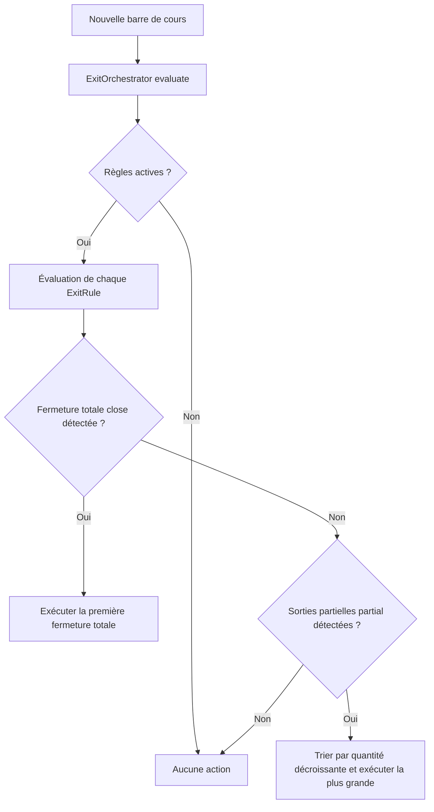

# Simulateur de Broker & Gestion des Sorties (Exit Rules)

**TL;DR** : Le moteur utilise un simulateur de broker déterministe couplé à un orchestrateur de règles de sortie. **Cette architecture permet de tester des conditions d'exécution réelles (commissions, slippage, ordres au marché de la bougie suivante) tout en centralisant les mécanismes complexes de stop-loss et de take-profit.**

Vous venez de coder une stratégie prometteuse. Ses signaux d'entrée sont parfaits. Vous lancez une simulation et tout semble indiquer des gains massifs. Pourtant, lors du passage en production, la réalité vous rattrape; les frais de transaction grignotent vos bénéfices, et les sorties de secours ne se déclenchent pas aux prix affichés sur vos graphiques historiques.

C'est le piège classique de la simulation parfaite. Dans un environnement théorique, un ordre est exécuté instantanément au prix de clôture exact. En réalité, le carnet d'ordres bouge; le courtier prélève une commission avec un plancher minimal, et l'exécution se fait avec un léger décalage (slippage).

Pour combler ce fossé, le module [broker.py](file:///home/kidpixel/trading_automation_v2/backtest_engine/broker.py) implémente un simulateur complet et déterministe qui reproduit ces contraintes.

---

## Intégration de la réalité du marché

### ❌ Le Mythe de l'Exécution Théorique

Exécuter des transactions directement au prix de signal sans tenir compte des coûts réels :

```python
# Modèle théorique qui ignore l'impact du marché
def on_signal(price):
    portfolio.buy(price, qty=100)
    # Gain estimé immédiat, mais irréaliste
```

### ✅ Le Modèle de Simulation Réaliste

Le simulateur de broker prend en compte les contraintes physiques du marché :

```python
# Utilisation de la configuration de broker réaliste
config = BrokerConfig(
    execute_on_next_bar=True,  # Exécution à l'ouverture de la bougie suivante (Next-Bar Execution)
    commission_rate=0.0005,    # Commission proportionnelle de 0.05%
    commission_min_long=1.0,   # Commission minimale de 1.0 unité
    slippage_per_side_long=0.5 # Glissement de 0.5 point sur le prix d'entrée
)
broker = BrokerSimulator(config)
```

---

## Le Système d'Orchestration des Sorties

L'orchestration des sorties (exits) repose sur le patron de conception **Exit Orchestration Pattern**. Plutôt que de disperser des conditions `if/else` complexes à l'intérieur de la méthode principale de la stratégie, la logique est découpée en règles autonomes évaluées à chaque nouvelle barre par l'orchestrateur.

### L'Orchestrateur (`ExitOrchestrator`)

L'orchestrateur évalue toutes les règles actives sur la bougie courante et résout les conflits selon les priorités suivantes :
1. Si une ou plusieurs règles demandent une fermeture totale (`close`), l'orchestrateur exécute immédiatement la première fermeture rencontrée.
2. Si seules des sorties partielles (`partial`) sont demandées, l'orchestrateur sélectionne l'action qui liquide la plus grande quantité de titres.



---

## Logique Interne des Règles de Sortie

Chaque règle hérite de la classe abstraite `ExitRule` et implémente sa propre logique mathématique de déclenchement.

### 1. TimeExitRule (Sortie Temporelle)
Permet de couper une position après un certain nombre de minutes ou à une heure fixe (par exemple pour éviter de garder une position ouverte pendant la nuit).
*   **Logique interne** : Elle examine le champ `minutes_until_close` de la barre courante ou compare l'horodatage de la barre avec l'heure cible au format `HH:MM`.

### 2. VWAPExitRule (Sortie sur croisement VWAP)
Coupe la position dès que le cours franchit la courbe VWAP (*Volume Weighted Average Price*).
*   **Logique interne** : Si la position est longue et que le cours de clôture passe sous le VWAP; ou si la position est courte et que le cours passe au-dessus du VWAP, la fermeture est déclenchée.

### 3. BoundaryExitRule (Sortie sur frontières de volatilité)
Règle spécifique utilisée par la stratégie Noise Boundary. Elle utilise des bandes supérieures et inférieures dynamiques comme niveaux de stop-loss.
*   **Logique interne** : Déclenche une fermeture totale si le prix franchit la bande inférieure pour un long ou la bande supérieure pour un short.

### 4. LadderExitRule (Sortie en échelle simple)
Permet de solder des fractions de position à des paliers de gains ou de pertes prédéfinis.
*   **Logique interne** : Elle stocke un ensemble d'étapes sous forme de couples `(seuil, ratio_quantité)`. Les seuils positifs représentent des prises de bénéfices; les seuils négatifs des stops. À chaque évaluation, elle calcule la variation en pourcentage depuis le prix moyen d'entrée. Si un seuil est franchi, la fraction de quantité correspondante est fermée et le palier est marqué comme exécuté pour cette position.

### 5. SequentialLadderExitRule (Sortie en échelle séquentielle)
Cette règle modélise une logique à plusieurs états (State Machine). Elle est notamment utilisée par la stratégie `3commas_bot` pour remonter dynamiquement ses niveaux de stop-loss après une première prise de bénéfices partielle.
*   **Logique interne** : 
    *   **État 0 (Initial)** : La règle surveille le Stop Loss initial (`stoploss_step0`) et le premier Take Profit (`takeprofit_step0`). Si le premier TP est atteint, elle renvoie une sortie partielle avec la quantité définie par `takeprofit_ratio0` et passe à l'**État 1**.
    *   **État 1** : Elle active le nouveau Stop Loss ajusté (`stoploss_step1`) et surveille l'objectif final (`takeprofit_step1`). Si l'un des deux est touché, elle solde la position restante (fermeture totale).

### 6. NetBracketExitRule (Bracket net de frais)
Calcule les objectifs de stop-loss et de take-profit en intégrant dynamiquement les commissions accumulées et le slippage estimé pour refléter le gain ou la perte nets réels.
*   **Logique interne** : 
    1. Calcule la valeur d'entrée de la position : `valeur = prix_moyen_entree * quantité * point_value`.
    2. Estime les frais d'entrée (déjà payés) et les frais de sortie (estimés au cours actuel).
    3. Calcule le PnL brut en monnaie de compte (avec conversion de devise via `fx_rate` si applicable).
    4. Calcule le PnL net : `PnL net = PnL brut - commissions d'entrée - commissions de sortie`.
    5. Déclenche la sortie si `PnL net >= TP net` ou si `PnL net <= SL net`.

### 7. SafetyStopExitRule (Stop de protection multi-mode)
Un coupe-circuit avancé configuré selon plusieurs modes de surveillance : perte nette en devise, perte nette en pourcentage, ou durée maximale de rétention en nombre de barres.
*   **Logique interne** :
    *   **Mode "Net loss only"** : Déclenche la sortie si la perte nette calculée (frais inclus) dépasse le seuil fixé en devise (`max_loss_cash`) ou en pourcentage (`max_loss_pct`).
    *   **Mode "Max bars only"** : Déclenche la sortie si la position est restée ouverte durant un nombre de barres supérieur ou égal à `max_bars`.
    *   **Mode "Net loss OR max bars"** : Combine les deux déclencheurs avec un opérateur logique OU (le premier atteint coupe la position).
    *   **Mode "Net loss AND max bars"** : Combine les deux déclencheurs avec un opérateur logique ET (la sortie n'a lieu que si la perte est avérée ET que la durée minimale en barres est dépassée).

---

## Logique de Dimensionnement des Positions (Position Sizing)

La méthode `calculate_position_size` détermine la taille de chaque trade selon trois modes distincts, tout en appliquant un garde-fou strict sur l'effet de levier maximal autorisé (`max_leverage`).

### Mode "fixed"
Renvoie une taille constante de `1.0` unité par défaut.

### Mode "percent_of_equity"
Alloue une fraction fixe du capital disponible (généralement 10% par défaut dans le simulateur).

### Mode "target_volatility"
Calcule une taille inversement proportionnelle à la volatilité historique de l'actif pour maintenir une exposition au risque constante.
*   **Formule mathématique** :
    $$\text{Taille} = \frac{\text{Capital} \times \text{Volatilité Quotidienne Cible}}{\text{Prix} \times \text{Volatilité Historique Réalisée}}$$
*   **Optimisation interne** : Pour éviter d'évaluer la volatilité sur l'intégralité du dataset à chaque trade, le moteur n'extrait que la queue finale des données historiques (`volatility_lookback_days + 2`) pour calculer l'écart-type des rendements, garantissant un temps de calcul inférieur à la milliseconde.

### Plafonnement par Effet de Levier (Leverage Cap)
Après calcul de la taille théorique, celle-ci est systématiquement bornée par le levier maximal configuré :
$$\text{Taille Maximale} = \frac{\text{Capital} \times \text{Levier Maximal}}{\text{Prix en devise de compte} \times \text{Valeur de point}}$$

---

## Calcul des Commissions et du Slippage

La méthode `commission_for` calcule les coûts de transaction en séparant les flux d'achat (Longs) et de vente (Shorts). Elle permet d'appliquer un plancher minimal pour simuler des barèmes de courtiers réels :
$$\text{Commission} = \text{Frais Fixes} + \text{Glissement (Slippage)} + \max(\text{Plancher Minimal}, \text{Valeur Notionnelle} \times \text{Taux})$$

---

## Table comparative des règles de sortie

| Règle | Type de sortie | Type de calcul | Cas d'usage principal |
| :--- | :--- | :--- | :--- |
| `TimeExitRule` | Totale | Temporel | Sorties de fin de journée (Intraday) |
| `VWAPExitRule` | Totale | Suivi de tendance | Sortie sur retournement de tendance moyen terme |
| `BoundaryExitRule` | Totale | Volatilité dynamique | Protection sur franchissement de bandes statistiques |
| `LadderExitRule` | Partielle | Pourcentage statique | Prise de profit par paliers fixes |
| `SequentialLadderExitRule` | Mixte (Partielle/Totale) | Séquentiel (Automate) | Trailing Stop dynamique (`3commas_bot`) |
| `NetBracketExitRule` | Totale | PnL net (frais inclus) | Prise de profit et stop de protection précis |
| `SafetyStopExitRule` | Totale | Multi-critères | Protection ultime du capital (Time & Cash) |

---

## La Règle d'Or : Simuler le pire pour garantir le meilleur

**La Règle d'Or : Le simulateur de broker doit toujours être configuré de manière plus conservatrice que le courtier réel.**

N'optimisez jamais une stratégie avec des frais à zéro ou sans slippage. En simulant systématiquement des commissions légèrement supérieures et en appliquant l'exécution sur la bougie suivante (`execute_on_next_bar=True`), vous vous assurez que les performances validées en backtest résisteront à la friction réelle du trading live.
