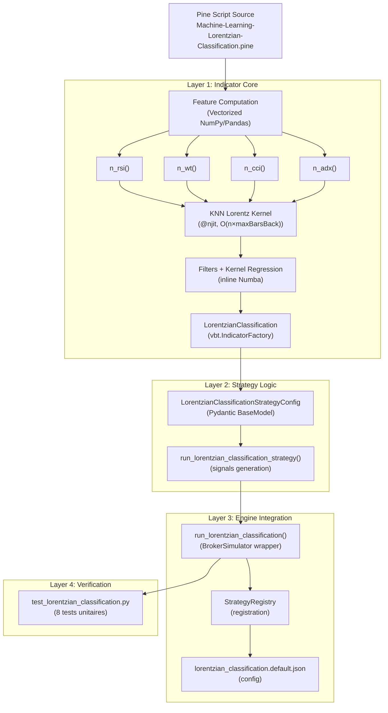

# Phase 4 : Lorentzian Classification KNN — Implémentation ML

Conversion du Pine Script [Machine-Learning-Lorentzian-Classification.pine](file:///home/kidpixel/trading_automation_v2/pine_scripts/indicator/Machine-Learning-Lorentzian-Classification.pine) en indicateur Numba haute performance intégré au `backtest_engine` VectorBT.

## User Review Required

> [!IMPORTANT]
> **Complexité algorithmique** : Le KNN Lorentz a une complexité O(n × maxBarsBack × featureCount). Pour n=5000, maxBarsBack=2000, featureCount=5, cela représente ~50M opérations float par run de backtest. Numba @njit réduit cela à ~100-200ms, mais cela reste le bottleneck pour l'optimisation Optuna. Acceptez-vous cette contrainte de performance ?

> [!WARNING]
> **Le filtre `i % 4`** du Pine Script original est un choix de design intentionnel (ANN approximatif, pas un vrai KNN exhaustif). Cela réduit le nombre d'itérations de ~75% mais peut manquer certains voisins proches. Ce comportement est conservé fidèlement.

> [!IMPORTANT]
> **Kernel Regression Nadaraya-Watson** : Le script Pine utilise une librairie externe `kernels.rationalQuadratic()` et `kernels.gaussian()`. Ces fonctions seront ré-implémentées inline dans Numba. Confirmez-vous que les sorties dynamiques (kernel-based) doivent être incluses, ou souhaitez-vous uniquement les sorties statiques (4 barres) ?

## Open Questions

> [!IMPORTANT]
> **Q1** : Le Pine Script supporte 2 à 5 features configurables (RSI, WT, CCI, ADX). Faut-il exposer le type de feature comme paramètre optimisable dans Optuna (choix string), ou fixer les 5 features par défaut et n'optimiser que les paramètres numériques (paramA, paramB) ?

> [!IMPORTANT]
> **Q2** : Le `STRATEGY_PARAMETER_DEFINITIONS` dans [configuration.py](file:///home/kidpixel/trading_automation_v2/backtest_engine/configuration.py) ne contient pas de définitions pour les stratégies Phase 3+ (HMM, ATC, Pivot, etc.). Faut-il ajouter un `LORENTZIAN_PARAMETER_DEFINITIONS` dans ce fichier, ou ce pattern est-il réservé aux stratégies historiques ?

---

## Proposed Changes

### Component 1: Indicateur Core Numba

#### [NEW] [lorentzian_classification.py](file:///home/kidpixel/trading_automation_v2/backtest_engine/indicators/lorentzian_classification.py)

**Architecture à 3 niveaux dans un seul fichier :**

**Niveau 1 — Helpers mathématiques @njit :**
```python
@njit(cache=True)
def calc_ema_nb(arr, length)          # EMA Wilder-style
def calc_rma_nb(arr, length)          # RMA (Wilder's MA pour RSI)
def calc_rsi_nb(close, length)        # RSI = 100 - 100/(1+RS)
def calc_cci_nb(close, high, low, length)  # CCI = (TP-SMA(TP))/(0.015*MeanDev)
def calc_adx_nb(high, low, close, length)  # ADX via DI+/DI-/DX
def calc_wt_nb(hlc3, len1, len2)      # WaveTrend WT = EMA(CI, len2)
def get_linear_interpolation(src, old_max, lookback)  # Min-max normalization
def n_rsi(close, len1, len2)          # Normalized RSI
def n_wt(hlc3, len1, len2)            # Normalized WaveTrend
def n_cci(close, high, low, len1, len2)  # Normalized CCI
def n_adx(high, low, close, len1)     # Normalized ADX
```

**Niveau 2 — Noyau KNN Lorentz @njit :**
```python
@njit(cache=True)
def _lorentzian_knn_1d_nb(
    close, high, low, ohlc4,
    f1, f2, f3, f4, f5,         # Features pré-calculées (n,)
    feature_count, neighbors_count, max_bars_back,
    # Filtres
    use_vol_filter, use_regime_filter, regime_threshold,
    use_adx_filter, adx_threshold, adx_len,
    use_ema_filter, ema_period, use_sma_filter, sma_period,
    # Kernel
    use_kernel_filter, kernel_h, kernel_r, kernel_x, kernel_lag, use_kernel_smoothing,
    use_dynamic_exits
) -> Tuple[prediction, signal, start_long, start_short, end_long, end_short]
```

Logique interne du KNN (fidèle au Pine Script lignes 383-398) :
```
for t in range(n):
    lastDistance = -1.0
    clear distances/predictions buffers
    sizeLoop = min(max_bars_back - 1, t - 1)  # Exclure barre courante
    for i in range(sizeLoop, -1, -1):          # Itérer oldest→newest via array indexing
        real_idx = t - 1 - i                    # Index réel dans l'historique
        d = lorentz_distance(features[t], features[real_idx], feature_count)
        if d >= lastDistance and real_idx % 4 != 0:
            push(d, y_train[real_idx]) into buffer
            if buffer.size > neighbors_count:
                lastDistance = buffer[75th_pctile]
                shift_front(buffer)
    prediction[t] = sum(predictions_buffer)
```

**Niveau 3 — IndicatorFactory :**
```python
LorentzianClassification = vbt.IndicatorFactory(
    class_name='LorentzianClassification',
    short_name='ldc',
    input_names=['high', 'low', 'close'],
    param_names=['neighbors_count', 'max_bars_back', 'feature_count',
                 'f1_param_a', 'f1_param_b', 'f2_param_a', 'f2_param_b',
                 'f3_param_a', 'f3_param_b', 'f4_param_a', 'f4_param_b',
                 'f5_param_a', 'f5_param_b',
                 'use_volatility_filter', 'use_regime_filter', 'regime_threshold',
                 'use_adx_filter', 'adx_threshold',
                 'use_ema_filter', 'ema_period', 'use_sma_filter', 'sma_period',
                 'use_kernel_filter', 'kernel_h', 'kernel_r', 'kernel_x',
                 'kernel_lag', 'use_kernel_smoothing', 'use_dynamic_exits'],
    output_names=['prediction', 'signal', 'start_long', 'start_short',
                  'end_long', 'end_short']
).from_apply_func(apply_lorentzian_classification, ..., keep_pd=True)
```

---

### Component 2: Stratégie Logique Pydantic

#### [NEW] [lorentzian_classification.py](file:///home/kidpixel/trading_automation_v2/pine_scripts_convert_to_python/strategy/lorentzian_classification.py)

- `LorentzianClassificationStrategyConfig(BaseModel)` avec tous les paramètres ML
- `run_lorentzian_classification_strategy(df, config)` → signaux d'entrée/sortie
- Pattern identique à [hmm_regime_filter_strategy.py](file:///home/kidpixel/trading_automation_v2/pine_scripts_convert_to_python/strategy/hmm_regime_filter_strategy.py)
- Valeurs par défaut Pine Script : `f1=RSI/14/1`, `f2=WT/10/11`, `f3=CCI/20/1`, `f4=ADX/20/2`, `f5=RSI/9/1`

---

### Component 3: Wrapper BrokerSimulator & Registry

#### [NEW] [lorentzian_classification.py](file:///home/kidpixel/trading_automation_v2/backtest_engine/strategies/lorentzian_classification.py)

- `LorentzianClassificationConfigOverrides(dataclass)` — paramètres ML + broker V3
- `run_lorentzian_classification()` — copie adaptée de [hmm_regime_filter.py](file:///home/kidpixel/trading_automation_v2/backtest_engine/strategies/hmm_regime_filter.py)
- `vectorbt_prescan()` — pass-through standard

#### [MODIFY] [strategy_registry.py](file:///home/kidpixel/trading_automation_v2/backtest_engine/strategy_registry.py)

- Ajouter import `from .strategies.lorentzian_classification import ...`
- Ajouter `StrategyRegistry.register(StrategyInfo(name="lorentzian_classification", ...))`

#### [NEW] [lorentzian_classification.default.json](file:///home/kidpixel/trading_automation_v2/configs/strategies/lorentzian_classification.default.json)

- Paramètres ML par défaut + paramètres broker V3 standard
- Format identique à [hmm_regime_filter.default.json](file:///home/kidpixel/trading_automation_v2/configs/strategies/hmm_regime_filter.default.json)

---

### Component 4: Tests & Documentation

#### [NEW] [test_lorentzian_classification.py](file:///home/kidpixel/trading_automation_v2/tests/test_lorentzian_classification.py)

8 tests unitaires :
| Test | Objectif |
|------|----------|
| `test_feature_normalization_causality` | Modifier barres futures → vérifier passé identique |
| `test_lorentz_distance_formula` | d(x,y) = Σ ln(1+\|x_j-y_j\|) sur vecteurs connus |
| `test_knn_no_self_comparison` | KNN à barre t n'utilise pas données ≥ t |
| `test_y_train_causality` | y_train[t] = sign(close[t]-close[t-4]) |
| `test_signal_generation` | Signaux corrects sur données synthétiques |
| `test_performance_benchmark` | < 500ms JIT froid, < 200ms cache chaud |
| `test_indicator_factory` | `LorentzianClassification.run()` retourne DataFrame |
| `test_registry_integration` | `lorentzian_classification` enregistré et callable |

#### [MODIFY] [analysis_results.md](file:///home/kidpixel/trading_automation_v2/pine_scripts/indicator/analysis_results.md)

- Mettre à jour le statut Phase 4 : `⏳ Lorentzian Classification` → `✅ Lorentzian Classification`

---

## Analyse Mathématique Critique

### Distance de Lorentz (pas de biais)
$$d(x, y) = \sum_{j=1}^{F} \ln(1 + |x_j - y_j|)$$

Propriétés clés :
- Robuste aux outliers (croissance logarithmique vs quadratique pour Euclidien)
- Chaque dimension contribue de manière bornée ∈ [0, ∞)
- Pas de normalisation croisée entre dimensions

### Labels d'entraînement (causal, vérifié)
```
y_train[t] = +1  si close[t] > close[t-4]  (prix a monté dans les 4 dernières barres)
y_train[t] = -1  si close[t] < close[t-4]  (prix a baissé)
y_train[t] =  0  sinon
```
✅ **Causal** : n'utilise que des données ≤ t

### Algorithme ANN (Approximate Nearest Neighbors)
Le Pine Script utilise un algorithme **non-standard** qui n'est PAS un KNN classique :
1. Itère de l'index le plus ancien au plus récent
2. N'accepte une distance que si `d ≥ lastDistance` (croissance monotone)
3. Espace les voisins d'au moins 4 barres (`i % 4`)
4. Maintient un buffer FIFO de taille `neighbors_count`
5. Recalibre `lastDistance` au 75ème percentile du buffer quand il est plein

Cet algorithme garantit une **distribution chronologiquement uniforme** des voisins.

### Kernel Regression Nadaraya-Watson
```
Rational Quadratic: K(x) = (1 + x²/(2rh²))^(-r)
Gaussian:           K(x) = exp(-x²/(2h²))

yhat = Σ K(i) * y[i] / Σ K(i)  pour i dans [1..lookback]
```

---

## Verification Plan

### Automated Tests
```bash
cd /home/kidpixel/trading_automation_v2
python -m pytest tests/test_lorentzian_classification.py -v --tb=short
```

### Manual Verification
- Compilation Numba JIT sans erreur de signature
- Import dans le StrategyRegistry sans crash
- Temps d'exécution < 200ms sur 5000 barres (cache chaud)
- Signaux visuellement cohérents sur un graphique test

---

## Diagramme d'Architecture


