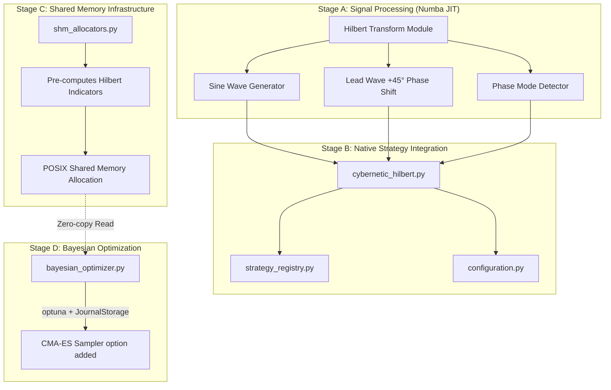

# Cybernetic Trading System — Implementation Plan

> Implementation of the institutional-grade cybernetic trading architecture based on Ruggiero's *Cybernetic Trading Strategies*, modernized with Hilbert Transform signal processing, leveraging the existing highly optimized backtesting engine and parallelized Optuna optimization.

## User Review Required

> [!IMPORTANT]
> **Architectural Simplification & Native Integration** — The original plan proposed a separate event engine, orchestrator, and WFA pipeline. Based on the current application architecture and responses, this has been simplified to directly integrate into the existing framework (`BrokerSimulator`, `bayesian_optimizer.py`, `walk_forward.py`). This guarantees zero duplication, zero regressions for existing strategies, and leverages the highly optimized POSIX shared memory infrastructure. Please review these adjustments before execution.

## Resolved Questions (from implementation_plan_reponses.md)

- **Q1 — Target Market & Data**: **Daily Timeframe** with Major Liquid Equities / FX Pairs is the primary target. Lower timeframes contain too much microstructure noise. The strategy is dynamic but defaults to Daily.
- **Q2 — Hilbert Implementation**: **John Ehlers' discrete FIR filter** compiled with Numba `@njit(cache=True)`. This guarantees strict causality (zero look-ahead bias) and $O(1)$ native runtime per step.
- **Q3 — JournalStorage vs SQLite**: **Existing Implementation Maintained**. The current `bayesian_optimizer.py` already implements `JournalStorage` robustly. No new orchestrator is needed.
- **Q4 — Sampler Selection**: **CMA-ES for Cybernetic**. Adding a `--sampler` flag (`tpe`, `cma_es`, `random`) to `bayesian_optimizer.py` to allow the smooth continuous mathematical space of the Hilbert strategy to be optimized efficiently with CMA-ES, while keeping TPE for existing strategies.

---

## Architecture Overview



---

## Proposed Changes

### Stage A — Hilbert Transform & Phase Indicators

#### [NEW] [hilbert_transform.py](file:///home/kidpixel/trading_automation_v2/backtest_engine/indicators/hilbert_transform.py)

Core mathematical module implementing John Ehlers' discrete Hilbert Transform for financial data. Must respect `codingstandards.md` regarding `float` (np.float64 for backtesting/vectorbt arrays).

**Key functions:**
- `hilbert_transform_ehlers(close: np.ndarray) -> tuple[np.ndarray, np.ndarray, np.ndarray, np.ndarray]`
  - Returns: `(sine_wave, lead_wave, instantaneous_phase, instantaneous_amplitude)`
  - Uses Ehlers' 4-bar FIR Hilbert filter coefficients.
  - **Numba `@njit(cache=True)`** for native speed.
  - Zero look-ahead bias: strictly causal bar-by-bar calculation.
- `compute_phase_mode(...)` and `compute_dominant_cycle(...)`
  - Numba JIT compiled functions for phase state analysis and period estimation.

#### [NEW] [__init__.py](file:///home/kidpixel/trading_automation_v2/backtest_engine/indicators/__init__.py)
New `indicators/` subpackage.

---

### Stage B — Strategy Wrapper & Registration

#### [NEW] [cybernetic_hilbert.py](file:///home/kidpixel/trading_automation_v2/backtest_engine/strategies/cybernetic_hilbert.py)

The native strategy module, following the existing pattern from `hma_crossover.py`. Integrates with the existing `BrokerSimulator`.

**Signal Logic**:
1. Compute Hilbert Transform → Sine Wave + Lead Wave.
2. **Buy signal**: Lead Wave crosses below Sine Wave.
3. **Sell signal**: Lead Wave crosses above Sine Wave.
4. **Phase Mode filter**: Only trade when `phase_mode == CYCLING`.

**Exports**:
- `CyberneticHilbertConfigOverrides`
- `run_cybernetic_hilbert(data, symbol, overrides, ...)`
- `load_cybernetic_hilbert_overrides_from_config()`
- `vectorbt_prescan()` — interface for shared memory calculation.

#### [MODIFY] [strategy_registry.py](file:///home/kidpixel/trading_automation_v2/backtest_engine/strategy_registry.py)
Register the 8th strategy (`cybernetic_hilbert`), linking the run functions and `vectorbt_prescan`.

#### [MODIFY] [configuration.py](file:///home/kidpixel/trading_automation_v2/backtest_engine/configuration.py)
Add hyperparameter definitions for `cybernetic_hilbert` (e.g., `hilbert_smooth_period`, `phase_mode_threshold`, etc.).

---

### Stage C — POSIX Shared Memory Allocation

#### [MODIFY] [shm_allocators.py](file:///home/kidpixel/trading_automation_v2/backtest_engine/shm_allocators.py)

To maintain compliance with `codingstandards.md` regarding massive memory usage during Optuna optimization, the Hilbert indicators must be pre-calculated and stored in POSIX shared memory.

- Add the pre-calculation logic for `cybernetic_hilbert`.
- Allocate `SharedIndicatorVolume` for the 4 arrays: `sine_wave`, `lead_wave`, `phase_mode`, and `dominant_cycle`.
- This ensures 0 DataFrame copies across parallel Optuna workers.

---

### Stage D — Bayesian Optimization Adaptation

#### [MODIFY] [bayesian_optimizer.py](file:///home/kidpixel/trading_automation_v2/backtest_engine/bayesian_optimizer.py)

The current implementation already properly uses `JournalStorage` and symmetric locking. We only need to integrate the CMA-ES sampler for continuous Hilbert spaces.

- Add a `--sampler` CLI flag (choices: `tpe`, `cma_es`, `random`).
- Inject `optuna.samplers.CmaEsSampler(with_margin=True)` when `--sampler cma_es` is provided.
- Set `cma_es` as the recommended default only when running the `cybernetic_hilbert` strategy.

---

## Verification Plan

### Automated Tests
- **Mathematical Correctness**: Unit tests for `hilbert_transform.py` verifying phase shift, causality, and Numba JIT functionality.
- **Integration**: Run the standard `pytest` suite ensuring all 7 existing strategies are untouched.
- **Optimization Pipeline**: Verify the CMA-ES sampler runs correctly with the existing multiprocessing engine and `JournalStorage`.

```bash
# Run unit tests
pytest tests/test_hilbert_transform.py -v

# Verify existing WFA and Optimizer run cleanly with CMA-ES
python -m backtest_engine optimize --strategy cybernetic_hilbert --symbol LOGI --sampler cma_es
```

## Risk Analysis

| Risk | Severity | Mitigation |
|:---|:---|:---|
| Numba Compilation Type Errors | High | Strictly enforce `np.float64` input arrays and pre-allocate numpy return arrays within the `@njit` functions. |
| Memory leak in SHM | High | Leverage the existing highly-tested `shm_allocators.py` cleanup contexts. |
| Look-ahead bias | Critical | Ehlers' FIR filter is causal by construction. Verify via shifted index testing. |

---

## Implementation Order

1. **Stage A** — `indicators/hilbert_transform.py` + unit tests.
2. **Stage B** — `strategies/cybernetic_hilbert.py` strategy logic.
3. **Stage C** — Register strategy in `configuration.py` and `strategy_registry.py`.
4. **Stage D** — Update `shm_allocators.py` to pre-calculate and share Hilbert grids.
5. **Stage E** — Update `bayesian_optimizer.py` to support the `--sampler cma_es` argument.
