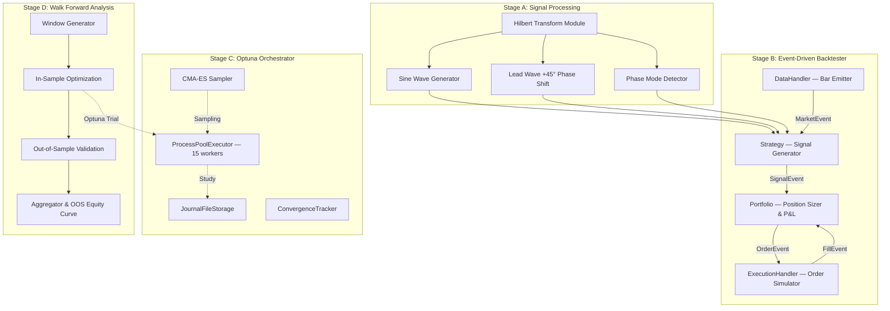

# Cybernetic Trading System — Implementation Plan

> Implementation of the institutional-grade cybernetic trading architecture based on Ruggiero's *Cybernetic Trading Strategies*, modernized with Hilbert Transform signal processing, event-driven backtesting, and parallelized Optuna optimization.

## User Review Required

> [!IMPORTANT]
> **This is a major architectural addition** — a new strategy family and optimization paradigm layered into the existing backtest engine. It touches 15+ new files and modifies 3 existing ones. Please review the design carefully before I begin coding.

> [!WARNING]
> **Breaking changes**: None. All existing 7 strategies remain untouched. The cybernetic system is registered as a new 8th strategy (`cybernetic_hilbert`) in `StrategyRegistry` and uses the existing shared memory / WFA infrastructure.

## Open Questions

> [!IMPORTANT]
> **Q1 — Target Market & Data**: Which symbols/assets should the initial Hilbert strategy target? The book uses D-Mark, Yen, Swiss Franc, T-Bonds. Your existing data is equity-focused (LOGI, etc.). Cycle analysis works best on daily bars. Should I use daily timeframe or stick with 5m intraday?

> [!IMPORTANT]
> **Q2 — Hilbert Implementation**: Two approaches available:
> - **A) `scipy.signal.hilbert`** — FFT-based, requires full-window computation, simpler but not truly causal (uses entire array).
> - **B) John Ehlers' analytic discrete Hilbert Transform** — FIR filter with fixed coefficients, truly causal (bar-by-bar), zero look-ahead, Numba-compilable. This is the preferred choice for an event-driven engine.
> - **Recommendation**: Option B (Ehlers' method). It eliminates look-ahead bias by design and compiles to native code with Numba.

> [!IMPORTANT]
> **Q3 — JournalStorage vs SQLite**: Your existing `bayesian_optimizer.py` uses Optuna's default in-memory study (no persistent storage). Should I:
> - **A)** Add `JournalFileStorage` as the **default** for all strategies when `workers > 1`?
> - **B)** Add it **only** for the new `cybernetic_hilbert` strategy, keeping existing behavior unchanged?
> - **Recommendation**: Option A — it fixes the "database is locked" risk for all parallel optimizations.

> [!IMPORTANT]
> **Q4 — CMA-ES vs TPE Sampler**: The current engine uses TPE. CMA-ES excels at smooth continuous parameter spaces (like Hilbert phase parameters). Should CMA-ES:
> - **A)** Replace TPE globally as the default sampler?
> - **B)** Be used only for `cybernetic_hilbert` (TPE remains default for other strategies)?
> - **C)** Be selectable via a `--sampler` CLI flag?
> - **Recommendation**: Option C — maximum flexibility.

---

## Architecture Overview



---

## Proposed Changes

### Stage A — Hilbert Transform & Phase Indicators

#### [NEW] [hilbert_transform.py](file:///home/kidpixel/trading_automation_v2/backtest_engine/indicators/hilbert_transform.py)

Core mathematical module implementing John Ehlers' discrete Hilbert Transform for financial data.

**Key functions:**
- `hilbert_transform_ehlers(close: np.ndarray) -> tuple[np.ndarray, np.ndarray, np.ndarray, np.ndarray]`
  - Returns: `(sine_wave, lead_wave, instantaneous_phase, instantaneous_amplitude)`
  - Uses Ehlers' 4-bar FIR Hilbert filter coefficients: `[0.0962, 0.5769, 0.5769, 0.0962]`
  - Applies Ehlers' smoothing and period correction with exponential moving averages
  - **Numba `@njit(cache=True)`** for native speed
  - Zero look-ahead: each bar computes from only past/current data
  
- `compute_phase_mode(phase: np.ndarray, dominant_period: np.ndarray, threshold: float = 0.33) -> np.ndarray`
  - Returns: mode array (1=trending, 0=cycling, -1=consolidating)
  - Based on Ruggiero's rate-of-change-of-phase vs. ideal rate comparison (Chapter 7, p.112-113)

- `compute_dominant_cycle(close: np.ndarray, min_period: int = 6, max_period: int = 50) -> np.ndarray`
  - Ehlers' adaptive period measurement via quadrature/in-phase component ratio
  - Bar-by-bar dominant period estimation

**Design rationale**: Ehlers' method is preferred over `scipy.signal.hilbert` because:
1. It is **causal** (FIR filter, no future data leakage)
2. It is **adaptive** (tracks changing dominant cycle automatically)
3. It compiles to LLVM via Numba (>100x faster than Python loops)
4. It is the standard in quantitative trading (MESA, TradeCycles)

#### [NEW] [__init__.py](file:///home/kidpixel/trading_automation_v2/backtest_engine/indicators/__init__.py)

New `indicators/` subpackage for reusable mathematical indicators.

---

### Stage B — Event-Driven Backtesting Engine

#### [NEW] [event_engine.py](file:///home/kidpixel/trading_automation_v2/backtest_engine/event_engine.py)

Core event-driven infrastructure — the event loop, event types, and component base classes.

**Event Types** (enum + frozen dataclasses):
```python
class EventType(Enum):
    MARKET = "MARKET"
    SIGNAL = "SIGNAL"  
    ORDER = "ORDER"
    FILL = "FILL"

@dataclass(frozen=True)
class MarketEvent:
    timestamp: pd.Timestamp
    bar_index: int
    open: float
    high: float
    low: float
    close: float
    volume: float

@dataclass(frozen=True)
class SignalEvent:
    timestamp: pd.Timestamp
    symbol: str
    direction: int  # +1 long, -1 short, 0 flat
    strength: float  # 0.0-1.0 confidence
    metadata: dict  # phase, amplitude, mode, etc.

@dataclass(frozen=True)
class OrderEvent:
    timestamp: pd.Timestamp
    symbol: str
    order_type: str  # "MARKET", "LIMIT"
    direction: int
    quantity: float
    
@dataclass(frozen=True)
class FillEvent:
    timestamp: pd.Timestamp
    symbol: str
    direction: int
    fill_price: float
    quantity: float
    commission: float
```

**Event Queue**: `collections.deque` — O(1) append/popleft, no thread contention needed for single-process backtesting.

#### [NEW] [data_handler.py](file:///home/kidpixel/trading_automation_v2/backtest_engine/data_handler.py)

Event-driven data feed that emits `MarketEvent` objects bar-by-bar.

- `HistoricalDataHandler.__init__(data: pd.DataFrame, symbol: str)`
- `HistoricalDataHandler.update_bars() -> MarketEvent | None` — advances one bar, returns event
- `HistoricalDataHandler.get_latest_bars(n: int) -> pd.DataFrame` — returns last N bars (look-behind only)
- `HistoricalDataHandler.continue_backtest -> bool` — are there more bars?

**Critical invariant**: `update_bars()` never exposes future data. The internal cursor `_current_bar` ensures strict temporal ordering.

#### [NEW] [cybernetic_hilbert.py](file:///home/kidpixel/trading_automation_v2/backtest_engine/strategies/cybernetic_hilbert.py)

The strategy module, following the existing pattern from `hma_crossover.py` / `pmax_explorer.py`.

**Signal Logic** (from Ruggiero Chapter 7 + Ehlers' modernization):
1. Compute Hilbert Transform → Sine Wave + Lead Wave (+45° phase shift)
2. **Buy signal**: Lead Wave crosses **below** Sine Wave (turning point anticipation)
3. **Sell signal**: Lead Wave crosses **above** Sine Wave
4. **Phase Mode filter**: Only trade when `phase_mode == CYCLING` (not during trends or consolidations)
5. Adaptive trailing stop: `0.5 × dominant_cycle` bars lookback for stop placement

**Exports** (following existing convention):
- `CyberneticHilbertConfigOverrides` — dataclass
- `run_cybernetic_hilbert(data, symbol, overrides, ...)` — runner function
- `load_cybernetic_hilbert_overrides_from_config()` / `cybernetic_hilbert_overrides_from_mapping()`
- `clear_cybernetic_hilbert_feature_cache()`
- `vectorbt_prescan()` — pre-computed indicator grid for shared memory

**Tunable Hyperparameters** (optimized via Optuna):
| Parameter | Type | Range | Description |
|:---|:---|:---|:---|
| `hilbert_smooth_period` | int | 4–20 | Smoothing window for Ehlers' computation |
| `phase_mode_threshold` | float | 0.2–0.5 | Cycling/trending boundary |
| `dominant_cycle_min` | int | 4–12 | Minimum detectable cycle period |
| `dominant_cycle_max` | int | 30–80 | Maximum detectable cycle period |
| `entry_phase_offset` | float | 30–60° | Lead Wave phase advance in degrees |
| `stop_cycle_fraction` | float | 0.3–0.7 | Trailing stop as fraction of dominant cycle |
| `signal_noise_threshold` | float | 0.5–3.0 | Min signal-to-noise ratio to trade |

#### [NEW] [portfolio_event.py](file:///home/kidpixel/trading_automation_v2/backtest_engine/portfolio_event.py)

Event-driven portfolio manager. Handles position sizing, P&L tracking, and order generation.

- Receives `SignalEvent`, generates `OrderEvent` based on:
  - Available capital (capped bucket model from existing `simulation_kernel.py`)
  - Target daily volatility sizing (ATR-based)
  - Maximum concurrent positions
- Receives `FillEvent`, updates:
  - Position state (entry price, quantity, stop/TP levels)
  - Running P&L (realized + unrealized)
  - Equity curve (bar-by-bar NAV)

#### [NEW] [execution_handler.py](file:///home/kidpixel/trading_automation_v2/backtest_engine/execution_handler.py)

Simulated order execution for backtesting. 

- Receives `OrderEvent`, simulates fill at `next_bar.open + slippage`
- Models: fixed slippage, proportional slippage, or volume-impact model
- Generates `FillEvent` with realistic fill price and commission

---

### Stage C — Optuna Orchestrator with JournalStorage

#### [NEW] [optuna_orchestrator.py](file:///home/kidpixel/trading_automation_v2/backtest_engine/optuna_orchestrator.py)

Replaces/wraps the Optuna integration in `bayesian_optimizer.py` for the cybernetic strategy, using production-grade multi-processing patterns.

**Key architecture decisions:**
1. **`JournalFileStorage`** instead of SQLite:
   ```python
   from optuna.storages import JournalStorage
   from optuna.storages.journal import JournalFileBackend
   
   storage = JournalStorage(
       JournalFileBackend(str(journal_path), lock_obj=optuna.storages.journal.JournalFileSymlinkLock(str(journal_path)))
   )
   ```
   - File-based append-only log with symlink-based locking
   - Zero "database is locked" errors under 15 concurrent processes
   - Journal files are recoverable and auditable

2. **CMA-ES Sampler** (when selected):
   ```python
   sampler = optuna.samplers.CmaEsSampler(
       n_startup_trials=20,
       seed=42,
       with_margin=True,
   )
   ```
   - Covariance matrix adaptation for smooth continuous search spaces
   - Converges faster than TPE on Hilbert-class parameter spaces (5-7 continuous floats)

3. **Sampler selection** via `SamplerType` enum:
   - `TPE` (default for existing strategies)
   - `CMA_ES` (default for cybernetic_hilbert)
   - `RANDOM` (for baseline comparison)

4. **Memory-efficient process pool**:
   - Uses `spawn` context (never `fork`) — avoids LLVM/Numba deadlocks
   - Pre-computes Hilbert indicator grid in parent process, shares via POSIX shm
   - Workers attach read-only views — zero DataFrame copies across 15 processes
   - Dynamic memory limit: `min(available_ram * 0.3, 64GB * 0.8)` 

#### [MODIFY] [bayesian_optimizer.py](file:///home/kidpixel/trading_automation_v2/backtest_engine/bayesian_optimizer.py)

Minimal modifications to support the new `--sampler` and `--storage` options:

- Add `sampler: str = "tpe"` parameter to `run_bayesian_optimization()`
- Add `storage_type: str = "memory"` parameter (values: `"memory"`, `"journal"`)
- Import and delegate to `optuna_orchestrator.py` when `sampler == "cma_es"` or `storage_type == "journal"`
- **No changes** to existing TPE/in-memory behavior — pure additive

#### [MODIFY] [strategy_registry.py](file:///home/kidpixel/trading_automation_v2/backtest_engine/strategy_registry.py)

Register the 8th strategy:
```python
StrategyRegistry.register(
    StrategyInfo(
        name="cybernetic_hilbert",
        config_override_class=CyberneticHilbertConfigOverrides,
        run_function=run_cybernetic_hilbert,
        load_overrides_function=load_cybernetic_hilbert_overrides_from_config,
        overrides_from_mapping_function=cybernetic_hilbert_overrides_from_mapping,
        indicators=["sine_wave", "lead_wave", "phase_mode", "dominant_cycle"],
        vectorbt_prescan=cybernetic_hilbert_vectorbt_prescan,
        clear_feature_cache=clear_cybernetic_hilbert_feature_cache,
    )
)
```

#### [MODIFY] [configuration.py](file:///home/kidpixel/trading_automation_v2/backtest_engine/configuration.py)

Add parameter definitions for `cybernetic_hilbert`:
- 7 tunable parameters with types, ranges, and defaults
- JSON schema for config file support

---

### Stage D — Walk Forward Analysis Pipeline

#### [NEW] [wfa_cybernetic.py](file:///home/kidpixel/trading_automation_v2/backtest_engine/wfa_cybernetic.py)

Specialized WFA pipeline for the cybernetic strategy, building on the existing [walk_forward.py](file:///home/kidpixel/trading_automation_v2/backtest_engine/walk_forward.py).

**Differences from existing WFA:**
1. Uses `optuna_orchestrator.py` with `JournalStorage` + CMA-ES for IS optimization
2. Supports daily-bar resampling (existing WFA is 5m-bar oriented)
3. Computes **cycle-specific OOS metrics**:
   - Signal-to-noise ratio stability across folds
   - Dominant cycle consistency (OOS dominant period vs IS dominant period)
   - Phase mode distribution shift detection
4. Anchored WFA variant: always starts IS from the same anchor date (expanding window)

**WFA fold flow:**
```
┌─────────────────────────────────────────────────────────────┐
│ For each fold (IS window → OOS window):                     │
│  1. Load IS data slice from canonical Parquet               │
│  2. Pre-compute Hilbert indicator grid on IS data           │
│  3. Share grid via POSIX shm to 15 worker processes         │
│  4. Run Optuna CMA-ES optimization (N trials) on IS         │
│  5. Extract best parameters                                 │
│  6. Validate best params on OOS data (single-process)       │
│  7. Compute PBO / DSR overfitting diagnostics               │
│  8. Record fold result + OOS equity segment                 │
│  9. Cleanup shared memory segments                          │
│ 10. Advance window by OOS size                              │
└─────────────────────────────────────────────────────────────┘
```

---

### Testing Strategy

#### [NEW] [test_hilbert_transform.py](file:///home/kidpixel/trading_automation_v2/tests/test_hilbert_transform.py)

Unit tests for mathematical correctness:
- **Pure sine wave**: Verify phase extraction matches theoretical values (±2° tolerance)
- **Phase shift**: Verify Lead Wave leads Sine Wave by exactly 45° on synthetic data
- **Dominant cycle**: Verify period detection on composite sine waves
- **Causality**: Assert output[t] depends only on input[0:t+1]
- **Numba compilation**: Verify JIT compilation succeeds and outputs match pure-Python reference

#### [NEW] [test_event_engine.py](file:///home/kidpixel/trading_automation_v2/tests/test_event_engine.py)

Integration tests for the event-driven engine:
- **Event ordering**: MarketEvent → SignalEvent → OrderEvent → FillEvent
- **No look-ahead**: DataHandler never exposes future bars
- **P&L accuracy**: Cross-validate with vectorized backtest on same data
- **Commission/slippage**: Verify deductions in FillEvent and equity curve

#### [NEW] [test_journal_storage.py](file:///home/kidpixel/trading_automation_v2/tests/test_journal_storage.py)

Stress tests for multi-process robustness:
- **Concurrent writes**: 15 processes writing to same JournalFileStorage
- **Recovery**: Kill worker mid-trial, verify journal integrity
- **Memory cap**: Verify RSS stays under 64GB threshold during 1000-trial run

---

## Verification Plan

### Automated Tests
```bash
# Stage A: Hilbert mathematical correctness
pytest tests/test_hilbert_transform.py -v --tb=short

# Stage B: Event-driven engine integration
pytest tests/test_event_engine.py -v --tb=short

# Stage C: JournalStorage stress test (15 processes, 100 trials)
pytest tests/test_journal_storage.py -v --timeout=300

# Full pipeline: WFA with 3 folds
python -m backtest_engine optimize \
  --strategy cybernetic_hilbert \
  --symbol EURUSD \
  --sampler cma_es \
  --storage journal \
  --workers 15 \
  --trials 200
```

### Manual Verification
- Visually inspect Sine Wave / Lead Wave crossover plots on known cycle data
- Compare Hilbert-derived dominant cycle with MESA / TradeCycles reference values
- Monitor `htop` during 15-process stress test for memory stability
- Verify JournalStorage file growth is linear (no corruption or bloat)

---

## Risk Analysis

| Risk | Severity | Mitigation |
|:---|:---|:---|
| Hilbert Transform numerical instability on low-volatility periods | High | Clamp amplitude floor at `1e-10`, exponential smoothing on period |
| Look-ahead bias in phase computation | Critical | Ehlers' FIR filter is causal by construction; unit test with shuffled data |
| JournalStorage I/O bottleneck on 15 threads | Medium | Symlink-based locking; benchmark vs SQLite WAL mode |
| CMA-ES premature convergence on flat landscapes | Medium | `n_startup_trials=20` random exploration; fallback to TPE |
| Memory explosion during WFA with large DataFrames | High | Pre-shared POSIX shm; per-fold cleanup; dynamic memory limit |
| Numba compilation slowdown on first run | Low | `cache=True` flag; AOT compilation for CI |

---

## Implementation Order

1. **Stage A** — `indicators/hilbert_transform.py` + unit tests (pure math, no dependencies)
2. **Stage B** — Event engine + DataHandler + Strategy + Portfolio + ExecutionHandler
3. **Stage C** — `optuna_orchestrator.py` + JournalStorage + CMA-ES + bayesian_optimizer.py modifications
4. **Stage D** — `wfa_cybernetic.py` + full pipeline integration
5. **Stage E** — Strategy registration + configuration + CLI integration
6. **Stage F** — Stress testing (1000 trials, 24 workers) + memory profiling
7. **Stage G** — Documentation + Memory Bank update

**Estimated files**: 10 new files, 3 modified files, 3 test files = **16 total files**
